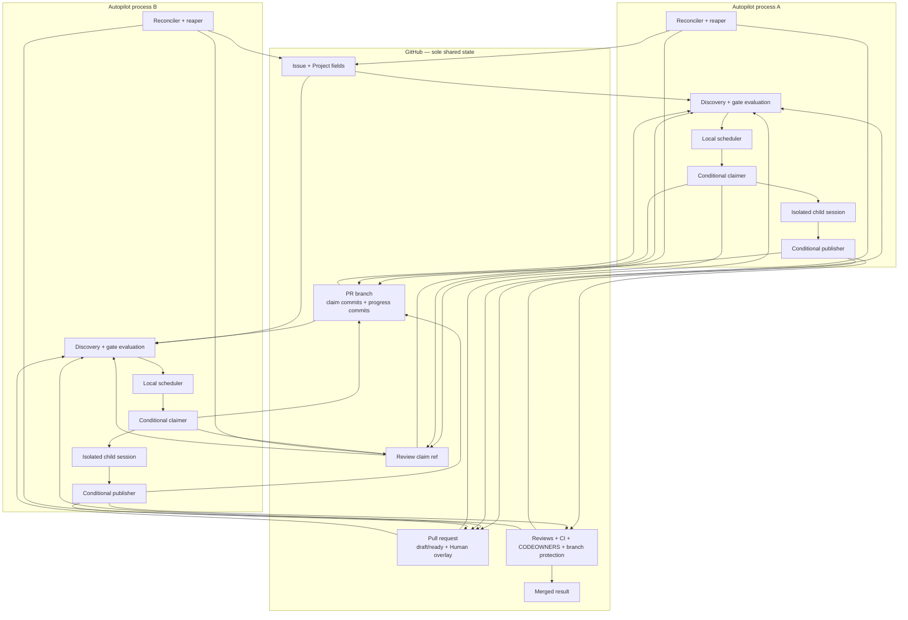

# Autopilot active-active lifecycle

## Status

- **Date:** 2026-07-19
- **Work shape:** `design`
- **Conversation status:** approved section by section
- **Document status:** approved
- **Implementation status:** implemented on the feature branch; live activation has not occurred

**Superseded by** [`2026-07-21-single-surface-lifecycle.md`](2026-07-21-single-surface-lifecycle.md)
(adopted). Where that amendment touches this document, it wins. In particular:

- **§7 (lifecycle states)** — `REVIEW-FIXING` and `MERGE-PREP` states are deleted;
  `BLOCKED-BY-CHILD` and the children ladder replace the fix loop and merge-prep.
- **§8.3 (review fix loop)** — in-session fix publication is deleted; findings become
  child issues (`review-finding`).
- **§8.4 (merge-prep protocol)** — deleted; reconcile children + tier-0
  update-branch replace it.
- **§8.6 (projection)** — Project Status is paint-only; the scheduled board painter
  owns outbound Status writes.

This document remains authoritative for claim CAS, review refs, head-bound verdicts,
claimless merge, staleness/reaping, attempt isolation, and credential handling not
amended above.

This document redesigns the Autopilot lifecycle so two or more independent
Autopilot processes can operate concurrently on the same host or different
hosts without interfering with one another.

This specification is authoritative for active-active lifecycle coordination.
Where it conflicts with earlier Autopilot design documents, local lease
assumptions, or the current dispatcher implementation, this document wins.
Earlier documents remain useful historical context for runtime mechanics and
workflow methodology that this design explicitly preserves.

The uncommitted active-active claim-store experiment in the
`codex/active-active-autopilot-claims` worktree is research material only. It
is not the baseline, an approved implementation, or evidence that every phase
needs a custom claim ref.

### Relationship to earlier design records

- The canonical implement-issue runtime-adapter design remains authoritative
  for one lifecycle skill, fresh root-stage mechanics, and the package-owned
  stateless Hermes launcher. This document changes lifecycle placement, not
  that adapter boundary.
- This document supersedes the local review-lease, local-worktree liveness, and
  timeout-cleanup assumptions in the 2026-07-18 review lifecycle recovery
  design.
- Existing internal review methodology, human-surface gates, first-push shape
  contracts, merge-prep authority limits, and merge-batch human authority are
  retained unless this document explicitly changes their state transition.

## 1. Executive summary

GitHub is the only shared source of truth. Autopilot processes do not
communicate directly, share a runner registry, or infer remote state from one
another's filesystems.

The design separates four concepts that the current system conflates:

1. **Claiming** elects one session authorized to publish for a work item and
   phase.
2. **Progress evidence** records recoverable work in GitHub.
3. **Liveness inference** decides whether unchanged GitHub-visible work is old
   enough to recover.
4. **Recovery** makes stale work eligible for a new ordinary claim.

The selected architecture is deliberately hybrid:

- Implementation and merge-prep claim by conditionally advancing the PR branch
  with a unique claim commit. The branch is already the artifact those phases
  are authorized to mutate.
- Review claims through one dedicated Git ref per PR because merely claiming a
  review must not change the code being reviewed.
- Merge has no claim. Multiple processes may make a head-pinned merge attempt;
  GitHub serializes the terminal result.
- GitHub Project status is an operator-facing lifecycle projection, never the
  mutual-exclusion primitive.
- A draft PR means either an active code-changing session or a deliberate Human
  hold. A non-draft PR is eligible to pass through review and merge gates.
- A branch-owning session becomes stale after two hours without a new PR head.
  A review becomes stale after two hours without either a new PR head or a
  terminal review verdict. Heartbeats and synthetic progress are forbidden.
- A reaper requeues stale implementation work; takeover is then an ordinary
  claim against the existing branch. There is no separate takeover state.
- Local artifacts are owned by one local attempt. Clean redundant artifacts
  may be removed at normal phase completion; dirty, ahead, or ambiguous
  artifacts survive until their work is safely redundant or a human resolves
  them.

The result guarantees one authoritative publishing implementation, review, or
merge-prep generation for a relevant head, while intentionally declining
global scheduling, instant crash detection, exactly-once API execution, and
exact recovery of never-pushed local work.

## 2. Goals and constraints

### 2.1 Goals

- Permit multiple independent Autopilot processes with independent local
  capacity.
- Support processes on the same host and on different hosts.
- Ensure one authoritative implementation per issue, one authoritative review
  session per PR head, and one authoritative merge-prep session per PR head.
  A previously stale operating-system process may still exist, but it is
  fenced from authoritative publication after replacement.
- Make all cross-runner decisions from GitHub state.
- Publish useful implementation and review-fix progress early enough to survive
  hard crashes.
- Recover stale work automatically after a generous initial threshold of two
  hours.
- Preserve implementer/reviewer identity separation for each PR.
- Preserve all human, CODEOWNER, CI, review, and merge gates.
- Keep Hermes as the single global runtime when configured, without assuming
  upstream Hermes changes.
- Make ambiguous writes and cleanup failures observable and recoverable.
- Prefer the smallest coordination protocol that satisfies the invariants.

### 2.2 Non-goals

- A globally fair scheduler.
- A globally shared capacity ceiling.
- Direct process-to-process messaging.
- A distributed runner registry or heartbeat service.
- Exactly-once GitHub API execution.
- Preservation of local work after permanent loss of a host when that work was
  never pushed.
- Automatic semantic conflict resolution.
- Bypassing a human decision because another automated check passed.
- Modifying or forking upstream Hermes.
- Treating the research claim-store experiment as an implementation plan.

## 3. How the current lifecycle actually works

### 3.1 Discovery and implementation dispatch

The current dispatcher polls GitHub Issues and the configured GitHub Project,
derives eligible `Todo` items, and combines this shared board data with a local
repository-scoped inventory of attempt worktrees.

`deriveInFlight` defines an implementation as active only when both are true:

- the issue is `In Progress` on the Project; and
- a matching local worktree exists.

Dispatch then:

1. changes the Project item to `In Progress`;
2. creates or reuses a deterministic local worktree;
3. launches the configured coordinator process;
4. retains PID, log, start-time, branch, and worktree information locally.

The Project change is unconditional. It does not express "move this item to
`In Progress` only if it is still `Todo`." Two processes can therefore both
observe `Todo`, both update the field, and both believe they own the issue.

The implementation skill currently opens the PR late, after the implementation
and internal review stages. Until then, commits and uncommitted changes may
exist only on one host.

### 3.2 Current implementation workflow

The canonical `implement-issue` workflow is richer than a single coding pass.
For ordinary code-producing work it performs:

1. reality check and classification;
2. design;
3. implementation planning;
4. implementation;
5. code review and finding-driven fixes;
6. independent review and finding-driven fixes;
7. security review and fixes where applicable;
8. app testing and fixes where applicable;
9. final verification and PR publication.

Those internal review loops are intentional. They improve the implementation
before it enters the external `review-pr` lifecycle and remain part of the new
design.

The canonical workflow also has first-push shapes such as `spike`, `incident`,
and `design`. Their purpose is to publish a bounded artifact or finding for a
human rather than enter the ordinary autonomous review-to-merge path.

### 3.3 Current review

The review loop discovers labeled, non-draft PRs that need review. It creates a
local `pr-<number>` worktree and a local lease, then launches the canonical
`review-pr` workflow.

That workflow owns the complete external loop:

1. review the current head independently;
2. if findings are blocking, request changes;
3. make the PR draft;
4. fix the findings on the PR branch;
5. review the new head again;
6. repeat until clean or escalate;
7. submit approval for the current head;
8. return the PR to ready state.

Review fixes are deliberately performed by the review session. They do not
return to the original implementation session.

The current lease and capacity calculation are local. A worktree can be
mistaken for a live reviewer, cleanup can release capacity incorrectly, and a
different host cannot distinguish live, dead, or completed review work from
the local lease.

### 3.4 Current merge preparation and merge

The merge sweep finds approved, green PRs. If a PR is behind or conflicting,
the optional merge-prep loop creates another local session. The canonical
merge-prep workflow may resolve mechanical conflicts only. Semantic conflicts
and CODEOWNER-sensitive changes escalate to a human.

Merge-prep currently treats draft restoration conservatively and may leave the
PR draft. The new lifecycle instead uses draft to describe the active mutation
window and restores ready state after a clean preparation so fresh review and
CI can run.

The merge operation itself is already close to the desired model: it can be
pinned to the expected head and must respect GitHub's gates. A separate
exclusive merge lease is unnecessary.

### 3.5 Current completion and cleanup

Completion is inferred partly from a prior-cycle local in-flight set and partly
from GitHub results. Worktree existence consumes local capacity. Normal and
timeout cleanup remove local worktrees. Drift recovery may inspect a stranded
local worktree, push committed work, and create a recovery PR.

These behaviors are useful on one host but become unsafe when elevated to
shared truth. In particular:

- another host's missing worktree cannot prove abandonment;
- another host cannot safely delete or classify a local artifact it cannot
  inspect;
- a stale directory cannot prove a process is dead;
- a live PID cannot prove the session still owns the GitHub branch;
- cleanup state cannot double as ownership state.

### 3.6 Coupled responsibilities

| Current signal or unit | Responsibilities currently coupled |
|---|---|
| Project `In Progress` | lifecycle display, dispatch suppression, implied ownership |
| Local issue worktree | local workspace, in-flight membership, crash evidence, recovery input |
| Local review worktree/lease | review ownership, liveness, capacity, cleanup authorization |
| PR draft state | publication readiness, review enrollment, partial recovery |
| Session exit | workflow result, slot release, cleanup trigger |
| Drift sweep | local inspection, abandonment inference, publication, escalation |
| Dispatcher loop | discovery, scheduling, projection, recovery, process tracking |
| Runtime configuration | process-wide runtime selection plus child mechanics |

The missing boundary is a lifecycle reconciler that derives the desired
operator-visible state from durable GitHub facts without treating those
projections as claims.

## 4. Design principles

1. **GitHub is the shared state.** Cross-runner decisions depend only on GitHub
   objects and conditional Git operations.
2. **Conditional publication is the fence.** A stale session may continue
   locally, but it cannot overwrite a newer owner.
3. **Project fields are projections.** They may lag and may be repaired
   idempotently.
4. **Real work is the heartbeat.** Only a new branch head or terminal review
   verdict establishes fresh progress.
5. **Recovery preserves artifacts.** Requeueing changes eligibility; it does
   not erase the existing branch, PR, or another host's files.
6. **Human is an overlay.** It parks the underlying lifecycle without
   flattening or destroying it.
7. **Draft has one operational meaning.** The PR is not currently eligible for
   ordinary review/merge because code is changing or a human hold is active.
8. **Gates remain native.** GitHub review state, CODEOWNERS, CI, branch
   protection, and merge rules are authoritative.
9. **Identity is per PR.** The reviewer must differ from the PR author; a login
   is not permanently limited to one global role.
10. **Capacity is local.** Each process decides how many local children it can
    run. GitHub-visible backlog provides shared backpressure.
11. **Ambiguity is resolved by read-back.** A timeout is not failure and a
    successful command response is not the only evidence of success.
12. **Local deletion requires local proof.** Cleanup is exact, attempt-scoped,
    and fail-closed.

## 5. Terminology: four separate signals

### 5.1 Claim

A claim is durable evidence that one attempt won authority to publish for one
phase and work item. It is created through a conditional Git ref transition.

A claim is not proof that the process is still alive and is not a heartbeat.

### 5.2 Progress evidence

Progress evidence is recoverable output:

- an implementation or fix commit pushed to the PR branch;
- a merge-prep result pushed to the PR branch;
- a review verdict attached to an exact PR head;
- a first-push artifact in the repository or structured PR body.

Local logs, PIDs, uncommitted changes, and commits that have not been pushed
are not shared progress evidence.

### 5.3 Liveness inference

Liveness is not represented directly. It is inferred conservatively:

- a branch-owning phase is considered idle when the current PR head has not
  changed for two hours;
- review is considered idle when neither the PR head nor a terminal verdict
  has changed for two hours.

The threshold is configurable and starts at two hours. It is not refreshed by
comments, CI activity, Project edits, process heartbeats, or synthetic commits
whose only purpose is to retain ownership.

### 5.4 Recovery

Recovery changes an idle claim into eligibility for another ordinary claim:

- stale implementation: reaper projects the issue back to `Todo`;
- stale review: reaper conditionally releases the review claim and exposes the
  current head as reviewable or review-fix-recoverable;
- stale merge-prep: reaper makes the current branch eligible for a new
  merge-prep claim.

Recovery is not ownership. The replacement becomes owner only after winning
its conditional claim.

## 6. System invariants

Downstream components may rely on the following invariants.

### 6.1 Shared-state invariants

1. **S1 — GitHub-only coordination:** no shared decision depends on a remote
   runner's PID, log, directory, worktree, process table, or clock state.
2. **S2 — Projection is not exclusion:** Project status, labels, comments, and
   draft state never grant publication authority by themselves.
3. **S3 — Exact-head decisions:** review, fix publication, merge-prep, approval,
   and merge are bound to an exact PR head OID.
4. **S4 — Read-back after ambiguity:** an ambiguous GitHub mutation is resolved
   by reading the exact ref, PR, review, Project item, or merge result.

### 6.2 Ownership invariants

5. **O1 — One implementation publisher:** at most one implementation attempt
   owns and can successfully publish against the current implementation branch
   head.
6. **O2 — One authoritative review:** at most one external
   review/fix/re-review claim generation is authoritative for a PR head at a
   time. A stale physical process may finish late, but its fixes and verdicts
   cannot become authoritative after its generation is replaced.
7. **O3 — One merge-prep publisher:** at most one merge-prep attempt can
   successfully publish against the current PR head.
8. **O4 — Stale writers are fenced:** after a replacement claim advances the
   relevant ref, the prior attempt cannot update it without observing and
   claiming the new state.
9. **O5 — Merge needs no claim:** duplicate head-pinned merge attempts are
   harmless and converge on GitHub's terminal state.

### 6.3 Publication invariants

10. **P1 — Early draft:** a successful implementation claim is followed
    idempotently by an existing draft PR before substantive implementation.
11. **P2 — Incremental durability:** meaningful implementation and review-fix
    checkpoints are pushed during the session, not only at its end.
12. **P3 — Ready precedes In Review:** a code-changing session makes the PR
    non-draft only after its final current-head verification and durable PR
    content (summary, lifecycle labels) succeed, and *before* writing the
    In Review Project status. In Review is unstable while the PR is still
    draft -- the reconciler projects any draft PR as `In Progress` (8.6) and
    would clobber an earlier write straight back -- so ready must precede,
    not follow, that projection.
13. **P4 — Draft mutation:** implementation, review fixes, and merge-prep
    mutate code only while the PR is draft.
14. **P5 — Human draft allowed:** a Human-held PR may remain draft even though
    no automated code-changing session is active.
15. **P6 — First-push hold:** `spike`, `incident`, and `design` publish their
    first-push result to a draft PR and then enter the Human overlay rather
    than autonomous external review.

### 6.4 Gate and identity invariants

16. **G1 — Native gates:** Autopilot cannot bypass required CI, CODEOWNER,
    human review, branch protection, or merge rules.
17. **G2 — Current-head approval:** approval is valid only for the PR head it
    reviewed; a subsequent push requires fresh evaluation under GitHub's
    normal rules.
18. **I1 — Per-PR separation:** the selected reviewer login differs from the PR
    author login.
19. **I2 — One child, one credential:** every child receives only its selected
    GitHub token and no usable ambient GitHub authentication.
20. **I3 — Implementer priority with one credential:** a one-credential runner
    prioritizes implementation and may review only PRs authored by another
    login.

### 6.5 Recovery and cleanup invariants

21. **R1 — GitHub-visible recovery point:** recovery begins from the latest
    GitHub-visible head and verdict, never from presumed remote local state.
22. **R2 — No absence inference:** missing local artifacts on one runner do not
    establish abandonment elsewhere.
23. **R3 — Requeue preserves progress:** reaping changes eligibility but does
    not delete the branch, PR, reviews, or unique local artifacts.
24. **R4 — Dirty work survives:** dirty, ahead, or ambiguous local artifacts
    are retained until published, proven redundant, or explicitly resolved.
25. **R5 — Terminal cleanup:** merged completion permits cleanup, but cleanup
    failure cannot reverse or obscure merged state.

### 6.6 Runtime and capacity invariants

26. **C1 — Local capacity:** every process enforces only its own implementation,
    review, and merge-prep caps.
27. **C2 — Shared backpressure:** the GitHub-visible queue may suppress *fresh*
    implementation, but machine children (`review-finding` / `reconcile` /
    `ci-failure`) remain claimable because they drain that queue. No global
    scheduler or license pool exists.
28. **H1 — Global runtime:** when Hermes is configured, it remains the selected
    process-wide runtime for implementation, review, merge-prep, and root
    stages.
29. **H2 — No upstream dependency:** the lifecycle requires no Hermes source
    change or upstream feature.

## 7. Lifecycle and state model

### 7.1 Logical states

Project status alone is not the full state. The logical lifecycle is derived
from the issue, PR, refs, reviews, checks, and Human overlay.

| Logical state | Durable GitHub evidence | Normal Project projection |
|---|---|---|
| Ineligible | missing triage, blocked dependency, disallowed author, or closed issue | existing non-dispatchable state |
| Eligible | open, triage-complete issue in `Todo`, no Human hold | `Todo` |
| Implementing | winning branch claim, open draft PR, current implementation head | `In Progress` |
| Implementation stale | draft implementation PR whose head is unchanged for two hours | temporarily `In Progress`, then reaped to `Todo` |
| First-push Human hold | draft PR with published shape output and Human overlay | `Human` |
| Reviewable | implementation ended cleanly; PR non-draft and needs external review | `In Review` |
| Reviewing | active review claim for exact non-draft PR head | `In Review` |
| Review fixing | active review claim, PR draft, reviewer-owned fix loop | `In Review` |
| Review stale | active review claim with no new head or terminal verdict for two hours | `In Review` |
| Approved / waiting gates | current-head approval exists; CI/CODEOWNER/human/stack gates may remain | `In Review` or `Human` overlay |
| Merge-preparing | winning prep claim, PR draft, mechanical reconciliation underway | `In Review` |
| Prepared for review | prep ended; PR non-draft with a new head requiring fresh review and CI | `In Review` |
| Merge eligible | all required gates pass for the exact current head | `In Review` |
| Merged | GitHub reports merged with terminal commit/result | `Done` |
| Human overlay | explicit Human marker plus preserved underlying PR/head state | `Human` |

### 7.2 State flow

```mermaid
stateDiagram-v2
    [*] --> Ineligible
    Ineligible --> Eligible: triage and gates satisfied
    Eligible --> Implementing: branch claim wins
    Implementing --> Implementing: meaningful checkpoint pushed
    Implementing --> Eligible: reaper sees unchanged head for 2h
    Implementing --> HumanHold: first-push shape or escalation
    Implementing --> Reviewable: internal loops clean; ready last

    Reviewable --> Reviewing: review claim wins for exact head
    Reviewing --> Approved: clean review and approval
    Reviewing --> ReviewFixing: blocking findings; redraft
    ReviewFixing --> Reviewing: fixes pushed; review exact new head
    Reviewing --> Reviewable: stale claim released
    ReviewFixing --> ReviewFixing: stale claim replaced on current draft head
    Reviewing --> HumanHold: semantic or policy escalation
    ReviewFixing --> HumanHold: fix or authority boundary reached

    Approved --> MergeEligible: all native gates pass
    Approved --> MergePreparing: conflict or behind state
    MergePreparing --> PreparedForReview: mechanical prep published; ready last
    MergePreparing --> HumanHold: semantic or CODEOWNER-sensitive conflict
    PreparedForReview --> Reviewable: fresh review required
    MergeEligible --> Merged: head-pinned merge succeeds

    HumanHold --> Implementing: human clears hold into implementation
    HumanHold --> Reviewable: human clears hold into review
    HumanHold --> Approved: human clears hold with current gates intact
    Merged --> [*]
```



### 7.3 Human overlay

Human is not a destructive terminal bucket. It preserves:

- the current branch and PR;
- draft or ready state appropriate to the hold;
- current approvals and check results, subject to normal invalidation;
- the phase from which work was parked;
- a machine-readable and human-readable reason.

When the hold is cleared, the reconciler derives the next state from current
GitHub evidence. It does not blindly restore a remembered Project value.

Human-held work is excluded from automatic reaping, review, merge-prep, and
merge unless the specific human action explicitly re-enrolls it.

### 7.4 Reaping and reclaim race

Reaping does not immediately fence the prior process. Only a new conditional
claim does.

If an old implementation pushes real progress after the reaper changes the
issue to `Todo` but before a replacement claim lands:

1. contenders based on the old head lose their conditional push;
2. the reconciler observes the new head;
3. the issue returns to `In Progress`;
4. the old attempt remains the publisher until it becomes idle again.

If a replacement claim lands first, the old attempt's later publication is
rejected because the remote head no longer matches its expectation.

This race preserves work and avoids pretending an eventually consistent
Project update is a fencing operation.

## 8. Selected architecture

### 8.1 Component and data-flow diagram



Both processes run the same protocol. They may derive the same candidates.
Conditional Git transitions decide which process may publish.

### 8.2 Branch-native claim protocol

Implementation and merge-prep use the PR branch because those phases are
authorized to mutate it.

#### Acquisition

1. Resolve the stable issue branch and fetch its exact remote state.
2. For a new implementation branch, select the approved base head. For a
   resumed implementation or merge-prep, use the current PR branch head.
3. Create a unique empty claim commit with that exact parent.
4. Push the claim commit to the stable issue branch without an unconditional
   force.
5. If the response is ambiguous, read the remote ref.
6. Ownership exists only if the remote ref is the contender's exact claim
   commit.

The claim commit records:

- protocol version;
- phase;
- issue and, when known, PR number;
- attempt nonce;
- runner diagnostic ID;
- selected GitHub login;
- expected parent OID;
- UTC claim time.

The runner ID aids diagnosis only. It is not a liveness signal.

Two contenders may create different commits from the same parent. Only one can
become the remote branch head. The loser does not create a substantive
worktree or child session.

#### Stable branch identity

New v2 work uses an issue-number-only branch identity:

```text
autopilot/<issue-number>
```

Issue titles, issue types, priorities, and target-base movement must not change
the branch name. This removes a hidden election split in the current
`<shape>/<number>-<title-slug>` convention: contenders that observed different
title or shape revisions could otherwise create different branches and both
win.

Migration does not rename an existing PR branch. If an issue already has one
unambiguous open PR, its current head branch becomes that issue's adopted
branch. A missing, duplicated, or contradictory issue-to-branch mapping fails
into Human reconciliation rather than guessing.

The target base is recorded in the claim and revalidated before PR creation
and publication. A concurrent issue-type, incident-route, or dependency-stack
change that implies a different base invalidates the attempt and requires
fresh derivation; it is never repaired by silently retargeting active work.

#### Implementation projection

After winning, the claimer idempotently ensures:

- the issue is `In Progress`;
- the stable/adopted branch has one open PR targeting the correct base;
- the PR is draft;
- the PR body links and closes the issue where appropriate;
- required lifecycle labels and metadata are present.

Partial completion is repaired by the reconciler. The claim remains the source
of ownership even if a Project update or PR creation call times out.

#### Publication

Implementation checkpoints use ordinary fast-forward publication from the
last expected head. Merge-prep may use an explicit expected-head lease when a
mechanical rebase necessarily rewrites history. An unconditional force push is
forbidden.

Before each publication, the session must still be based on the last head it
owned. After a non-fast-forward or lease failure, it stops publication,
preserves local work, and rereads GitHub.

#### Staleness

The current branch head's GitHub-visible commit time is the branch-phase
progress time. Canonical Autopilot claim and checkpoint commits use real UTC
committer time. A head that is unchanged for two hours is recoverable.

A missing, implausibly future-dated, or otherwise untrustworthy progress time
fails closed into Human inspection rather than permitting immediate takeover.

No empty heartbeat commit may be created merely to extend ownership. The
initial claim commit is allowed because it performs election; later commits
must contain meaningful work, fixes, or merge preparation.

### 8.3 Review claim protocol

Review must be claimed without changing the PR branch. Each PR therefore has
one dedicated ref:

```text
refs/jinn-autopilot/review-claims/v1/<pr-number>
```

The ref points to an append-only metadata commit. Each metadata commit names:

- PR number;
- exact PR head OID;
- claim generation and nonce;
- selected reviewer login;
- claim time;
- last real progress time;
- state: `active`, `verdict-intent`, `fixing`, `released`, `stale`, or
  `terminal`;
- previous claim metadata OID when present.

#### Compare-and-swap requirement

Every metadata commit after the first has the exact current review metadata
commit as its Git parent. Creation succeeds only while the ref is absent.
Later ordinary fast-forward pushes succeed only while the expected parent is
still current. Two updates from the same parent therefore elect one winner
without force. An ambiguous response is resolved by reading the ref.

The implementation may use any GitHub-supported ref operation that demonstrably
provides this expected-state behavior. It must not simulate compare-and-swap
with an unconditional read followed by an unconditional write.

#### Review acquisition

A contender:

1. verifies the PR is reviewable and the selected reviewer differs from the
   PR author;
2. binds eligibility to the exact current head;
3. reads the review ref;
4. conditionally creates or advances it to its unique active metadata commit;
5. rereads on ambiguity;
6. starts a child only if its exact metadata commit is current.

#### Fix loop

The review session begins from a non-draft PR. If it finds blocking issues:

1. conditionally advance the review ref to a `verdict-intent` generation that
   names the exact head, `REQUEST_CHANGES`, and a unique verdict marker;
2. submit the native non-approval verdict for that exact commit with the marker;
3. read back the native verdict and advance the claim to `fixing`;
4. make the PR draft;
5. fix on top of the exact current head;
6. create the fix commit and its next review metadata commit locally;
7. atomically advance both the PR branch and review ref;
8. independently re-review that new head.

The fix publication is one remote ref transaction: either the expected PR head
advances to the fix commit and the expected review ref advances to metadata for
that same fix head, or neither ref changes. `git push --atomic` provides this
all-or-nothing contract when advertised by the remote; another implementation
is acceptable only if it proves the same two-ref expected-state transaction.
If the remote lacks the required capability, active-active automated review
fixes fail closed rather than falling back to sequential unfenced writes.

This atomic pair is load-bearing. A replacement that already advanced the
review ref prevents the old reviewer from pushing fixes even when the PR branch
itself has not yet changed.

When clean:

1. conditionally advance the review ref to a `verdict-intent` generation that
   names the exact head, `APPROVE`, and a unique verdict marker;
2. submit native approval for that exact commit with the marker;
3. read back the approval;
4. conditionally advance the review ref to `terminal`;
5. make the PR non-draft only after the matching terminal approval exists.

Autopilot's merge gate accepts an automated approval only when its exact
head, reviewer login, and marker match the current terminal review-ref
generation. A stale physical reviewer may submit a late native review, because
GitHub review submission cannot atomically consume the custom claim ref, but
that review is not authoritative after its generation has been replaced.
Native `REQUEST_CHANGES` state is always respected even when it is stale or
duplicated; ambiguity may delay automation but cannot make it merge less
safely.

The marker requirement applies to Autopilot's automated reviewer identities.
Human and CODEOWNER approvals remain native GitHub gates and are neither
rewritten nor required to participate in the review-claim protocol.

If the process crashes after approval or ready transition, read-back completes
the remaining projection without repeating fixes.

#### Review staleness

Review becomes stale after two hours with neither:

- a new PR branch head; nor
- a terminal review verdict for the claimed head.

CI, comments, Project edits, and intent-only metadata transitions do not reset
the clock. Winning a review claim generation initializes `lastRealProgressAt`
for that generation — election is the one permitted review progress event,
exactly as the initial claim commit is for branch phases (§8.2 Staleness) —
after which only a changed PR head or a confirmed native verdict for the
claimed head updates it further. The reaper conditionally advances the exact
old review claim to a stale generation. A replacement then appends an
ordinary active claim generation, which starts its own fresh window from its
own election.

A stale draft PR from an interrupted review-fix loop remains draft and
review-fix-recoverable. It does not return to implementation or `Todo`.

### 8.4 Merge-prep protocol

Merge-prep:

1. requires a PR whose current approved path is blocked by behind/conflict
   state;
2. selects an implementer-capable credential;
3. claims the exact PR branch head with a merge-prep claim commit;
4. makes the PR draft;
5. resolves mechanical conflicts only;
6. publishes with an exact expected-head lease;
7. records the new head;
8. makes the PR non-draft last;
9. returns it to `In Review` for fresh review and CI.

Semantic, architectural, security-sensitive, or CODEOWNER-sensitive conflicts
enter the Human overlay. Merge-prep cannot approve its own result or preserve
an approval that GitHub invalidates.

### 8.5 Merge protocol

There is no merge claim.

Any process may attempt merge only after verifying all gates for exact head
`H`. The merge request includes `H` as the expected head. Outcomes are:

- success: GitHub reports the PR merged;
- rejected: a gate failed or the head changed;
- ambiguous: reread the PR and merge result.

If two processes attempt the same merge, at most one changes repository state.
The other observes merged or changed state. This is simpler and no less safe
than serializing merge attempts separately.

### 8.6 Project projection

The reconciler maps durable facts to Project state:

- eligible issue → `Todo`;
- active implementation claim and draft PR → `In Progress`;
- clean non-draft PR through review/merge gates → `In Review`;
- explicit Human overlay → `Human`;
- merged PR → `Done`.

Projection writes are idempotent and may race. Because they do not confer
authority, last-writer races are repaired by subsequent derivation. Every
projection write is followed by enough read-back to distinguish success,
failure, and ambiguity.

### 8.7 External primitives relied upon

The design depends on a small, testable set of native contracts:

- Git rejects non-fast-forward ref updates, allowing two commits with the same
  expected parent to elect one winner.
- [`git push --atomic`](https://git-scm.com/docs/git-push) updates every named
  ref or none and fails when the remote does not advertise atomic support.
- GitHub's
  [pull-request review API](https://docs.github.com/en/rest/pulls/reviews)
  accepts an exact `commit_id`, so an automated verdict can be bound to the
  reviewed head.
- GitHub's
  [merge API](https://docs.github.com/en/rest/pulls/pulls#merge-a-pull-request)
  accepts the SHA that the PR head must match and rejects a changed head.

The implementation must prove these behaviors against the actual repository
and credential types before active mode is enabled. A missing capability fails
closed and returns the affected phase to design rather than weakening its
fence silently.

## 9. Component contracts

Every component below has one responsibility and an explicit authority
boundary.

### 9.1 Work discovery and eligibility

| Property | Contract |
|---|---|
| Single responsibility | Produce candidate issues and PRs whose durable GitHub state permits evaluation for a phase. |
| Inputs and outputs | Inputs: GitHub issue/PR/Project/ref snapshots and configuration. Outputs: immutable candidate records with exact OIDs and reasons. |
| Durable source of truth | GitHub Issues, Project fields, PRs, refs, labels, dependencies, and native gate state. |
| Local versus shared | Query caches and polling cursors are local; every eligibility fact is shared in GitHub. |
| Authority and prohibitions | Read-only. It cannot claim, mutate status, spawn, reap, or clean. |
| Idempotency | Repeated discovery over the same GitHub snapshot returns the same candidates and reasons. |
| Concurrent behavior | All runners may discover the same candidate; this is expected and harmless. |
| Failure and recovery | Query failure produces no candidate from incomplete data. Retry from a fresh snapshot; never infer eligibility from absence in a partial response. |
| Downstream invariants | Candidate includes exact issue/PR identity, head OID where relevant, eligibility reason, and snapshot version/time. It does not imply ownership. |

### 9.2 Gate evaluation

| Property | Contract |
|---|---|
| Single responsibility | Decide whether a candidate satisfies the policy gates for one transition. |
| Inputs and outputs | Inputs: candidate, current GitHub snapshot, workflow policy. Output: pass/fail/indeterminate plus exact blocking reasons. |
| Durable source of truth | Native GitHub reviews, checks, CODEOWNERS/branch protection results, dependencies, labels, draft state, and Human overlay. |
| Local versus shared | Evaluation code and cached policy are local; evaluated facts are shared. |
| Authority and prohibitions | Read-only. It cannot waive, fabricate, or bypass a gate. |
| Idempotency | The same snapshot and policy yield the same decision. |
| Concurrent behavior | Runners may evaluate concurrently; a later writer must revalidate head-sensitive gates before publication. |
| Failure and recovery | Missing or contradictory gate data is `indeterminate`, never pass. Retry from GitHub. |
| Downstream invariants | `pass` names the exact head and policy inputs evaluated; it expires when relevant GitHub state changes. |

### 9.3 Claiming and ownership

| Property | Contract |
|---|---|
| Single responsibility | Elect one publishing attempt for one phase and exact work state. |
| Inputs and outputs | Inputs: eligible candidate, expected ref state, attempt identity, selected login. Output: won/lost/indeterminate with durable claim OID. |
| Durable source of truth | PR branch claim commit for implementation/prep; dedicated review claim ref for review. |
| Local versus shared | Attempt nonce and command process are local until published; the winning ref state is shared. |
| Authority and prohibitions | May perform only the conditional claim transition. It cannot treat Project edits, labels, or local locks as ownership. |
| Idempotency | Retrying the same attempt recognizes its exact winning claim; a different attempt cannot impersonate it. Review metadata updates form an append-only expected-parent chain. |
| Concurrent behavior | Exactly one expected-state ref transition wins. Losers do not spawn substantive sessions. |
| Failure and recovery | Ambiguous mutation requires exact ref read-back. A stale claim is changed only by the reaper's conditional transition. |
| Downstream invariants | A returned winning claim names the phase, work item, expected prior state, selected identity, and current claim OID. |

### 9.4 Lifecycle projection and reconciliation

| Property | Contract |
|---|---|
| Single responsibility | Make operator-visible GitHub lifecycle fields agree with underlying durable facts. |
| Inputs and outputs | Inputs: issues, PRs, refs, reviews, gates. Outputs: idempotent Project/draft/label/body corrections and a reconciliation report. |
| Durable source of truth | Underlying GitHub refs and native PR state; projection fields remain durable but derived. |
| Local versus shared | Reconciliation plan is local; all applied projections are shared. |
| Authority and prohibitions | May repair projections. It cannot create ownership, discard progress, approve, or bypass gates. |
| Idempotency | Reapplying the desired projection is harmless. |
| Concurrent behavior | Multiple reconcilers may apply the same result. Conflicting stale writes are corrected from a fresh derivation. |
| Failure and recovery | Partial projection is left visible and retried. Ambiguous writes are read back. |
| Downstream invariants | Consumers may use projections for UX and coarse filtering but must rederive authority from refs and exact heads. |

### 9.5 Capacity, scheduling, and backpressure

| Property | Contract |
|---|---|
| Single responsibility | Select which eligible claims one process will attempt within its own resources. |
| Inputs and outputs | Inputs: eligible candidates, local active children, per-phase caps, GitHub backlog, rate-limit health. Output: ordered claim attempts or skips with reasons. |
| Durable source of truth | GitHub backlog for shared pressure; configuration for local caps. |
| Local versus shared | Capacity counters, ordering, and resource measurements are local. Backlog and rate limits are shared observations. |
| Authority and prohibitions | May defer or attempt a claim. It cannot reserve global capacity or suppress another process. Open-pipeline backpressure suppresses only fresh implementation candidates; machine children still claim under local phase remaining. |
| Idempotency | Re-evaluation may choose again; only the claim transition has external effect. |
| Concurrent behavior | Runners schedule independently and may race. Losing a claim immediately returns local capacity. |
| Failure and recovery | Scheduler crash loses only local choices. Restart derives GitHub work and local children again. |
| Downstream invariants | A scheduler decision is advisory and time-bounded; it never conveys ownership. |

### 9.6 Implementation

| Property | Contract |
|---|---|
| Single responsibility | Turn one claimed issue into a verified implementation or bounded first-push artifact. |
| Inputs and outputs | Inputs: issue, winning claim, draft PR, canonical workflow, runtime adapter, selected credential. Outputs: pushed checkpoints, updated PR, ready-for-review result or Human escalation. |
| Durable source of truth | PR branch commits, draft PR, PR body, Project projection, and Human marker. |
| Local versus shared | Working tree, stage reports, logs, and unpushed edits are local. Pushed commits and PR state are shared. |
| Authority and prohibitions | May mutate only its claimed branch and lifecycle projections. It cannot externally approve, merge, bypass Human/CODEOWNER gates, or overwrite a changed head. |
| Idempotency | Setup reuses the stable or adopted branch/PR; repeated finalization recognizes already-pushed commits and already-applied projections. |
| Concurrent behavior | Only the branch-claim winner starts. Any stale publication loses against the newer remote head and stops. |
| Failure and recovery | Push meaningful checkpoints. On crash, replacement starts from current remote head; local-only work may be redone and is retained locally. |
| Downstream invariants | A non-draft result has passed all canonical internal review/fix loops and final verification for its exact head. |

### 9.7 Progress durability

| Property | Contract |
|---|---|
| Single responsibility | Publish recoverable, meaningful checkpoints and record their exact heads. |
| Inputs and outputs | Inputs: verified local changes and expected remote head. Output: confirmed new remote head or explicit conflict/ambiguity. |
| Durable source of truth | PR branch and exact commit OIDs; review verdicts for review progress. |
| Local versus shared | Candidate commit is local before push; confirmed remote OID is shared. |
| Authority and prohibitions | May publish work owned by the current attempt. It cannot send synthetic heartbeat commits or publish after losing the expected head. Review fixes must advance the branch and review ref in one expected-state transaction. |
| Idempotency | Retry recognizes when the exact commit already became remote head. |
| Concurrent behavior | Conditional publication serializes contenders; a conflict triggers reread, never blind retry. |
| Failure and recovery | Ambiguous push is read back. Rejected push retains local commits and marks the attempt fenced. |
| Downstream invariants | A confirmed checkpoint is reachable from the current or historical GitHub branch state and can seed recovery. |

### 9.8 Review

| Property | Contract |
|---|---|
| Single responsibility | Independently evaluate one exact PR head and produce findings or a terminal verdict. |
| Inputs and outputs | Inputs: review claim, exact head, PR context, selected non-author login. Outputs: findings, request-changes/comment verdict, or approval bound to the head. |
| Durable source of truth | Review claim ref and native GitHub review records. |
| Local versus shared | Analysis notes and child reports are local until submitted; claim and verdict are shared. |
| Authority and prohibitions | May inspect and review. It cannot approve the reviewer's own PR, approve a different head, merge, waive human gates, or publish an authoritative verdict without a matching current review-ref intent marker. |
| Idempotency | Before resubmission, read the current claim generation and existing marker-bearing current-head verdicts. Do not duplicate a terminal verdict unnecessarily. |
| Concurrent behavior | Review ref CAS elects one session. A head change invalidates the evaluated snapshot and requires re-review. |
| Failure and recovery | No changed head or confirmed verdict for two hours permits claim recovery. Submitted verdicts survive the process; only a verdict matching the current review generation is authoritative for automated merge. |
| Downstream invariants | An authoritative terminal verdict identifies exact head, reviewer login, claim generation, and matching native GitHub review marker. |

### 9.9 Review-driven fixes and re-review

| Property | Contract |
|---|---|
| Single responsibility | Resolve blocking review findings and independently re-evaluate each resulting head within the same review session. |
| Inputs and outputs | Inputs: active review claim, findings, exact branch head. Outputs: draft PR, pushed fix commits, updated claim head, and new review cycle. |
| Durable source of truth | PR draft state, fix commits, review claim ref, and subsequent review verdicts. |
| Local versus shared | Unpushed fixes are local; pushed fixes and claim generations are shared. |
| Authority and prohibitions | Reviewer credential may push fixes to the PR branch while holding review ownership. It cannot return fixes to implementation merely for role purity, approve without independent re-review, or update the fix branch separately from its review generation. |
| Idempotency | Detect an already-completed atomic branch/ref publication before repeating actions. |
| Concurrent behavior | Draft state blocks ordinary review discovery; atomic expected-state advancement of branch plus review ref fences replacements and stale writers. |
| Failure and recovery | Crash after redraft leaves a recoverable review-fix state. Atomic publication leaves both refs old or both refs new; ambiguous results read back both. Dirty local fixes are retained. |
| Downstream invariants | Approval after fixes applies to the final fixed head, not the pre-fix head. |

### 9.10 Merge preparation

| Property | Contract |
|---|---|
| Single responsibility | Make an otherwise approved PR mechanically current and mergeable without making semantic decisions. |
| Inputs and outputs | Inputs: exact PR head, target base, prep claim, conflict classification. Outputs: mechanically prepared head, fresh-review state, or Human escalation. |
| Durable source of truth | PR branch claim/prep commits, draft state, and Human marker. |
| Local versus shared | Rebase workspace and conflict analysis are local; pushed result and PR state are shared. |
| Authority and prohibitions | May resolve mechanical conflicts using an implementer credential. It cannot resolve semantic/CODEOWNER-sensitive conflicts, approve, or merge. |
| Idempotency | Recheck whether the PR is already current before claiming or publishing. Repeated projection is harmless. |
| Concurrent behavior | Exact-head claim and lease elect one publisher. Target-base movement before publication causes restart or escalation, not blind force. |
| Failure and recovery | Published prep survives crashes. Local unresolved conflicts remain retained. Stale prep can be reclaimed from current remote head. |
| Downstream invariants | A clean prep result is non-draft, unapproved unless native rules preserve it, and requires fresh gate evaluation. |

### 9.11 Merge

| Property | Contract |
|---|---|
| Single responsibility | Ask GitHub to perform the terminal integration for one exact fully gated head. |
| Inputs and outputs | Inputs: PR, exact head OID, verified gate snapshot. Output: merged result, rejected reason, or changed-head result. |
| Durable source of truth | GitHub PR merged state and merge commit/result. |
| Local versus shared | Request attempt and logs are local; merged state is shared. |
| Authority and prohibitions | May invoke the allowed merge operation. It cannot force merge, bypass gates, alter code, or synthesize approvals. |
| Idempotency | Repeating against an already-merged PR returns terminal success. |
| Concurrent behavior | Multiple head-pinned attempts are allowed; GitHub serializes the result. |
| Failure and recovery | Ambiguous response is resolved by rereading PR merged state and merge commit. |
| Downstream invariants | `merged` is terminal for that PR and authorizes lifecycle completion and guarded cleanup. |

### 9.12 Completion and cleanup

| Property | Contract |
|---|---|
| Single responsibility | Project terminal lifecycle state and remove only locally proven redundant artifacts. |
| Inputs and outputs | Inputs: merged/phase-terminal GitHub state and exact local session manifest. Outputs: `Done` projection, cleanup result, retained-artifact report. |
| Durable source of truth | GitHub terminal state for completion; inspected local filesystem/Git state for cleanup safety. |
| Local versus shared | Completion is shared; cleanup decisions and artifacts are local to each host. |
| Authority and prohibitions | May delete only the exact attempt path after cleanliness/redundancy checks. It cannot delete by broad glob, delete another host's work, or treat cleanup as completion. |
| Idempotency | Reapplying `Done` and finding an already-removed exact path are successful no-ops. |
| Concurrent behavior | Each runner cleans only its own manifests. Multiple completion projections converge. |
| Failure and recovery | Cleanup failure retains the path and records the reason. Completion remains terminal and cleanup may retry. |
| Downstream invariants | Missing local artifacts after a confirmed cleanup say nothing about other hosts; GitHub remains sufficient to know completion. |

### 9.13 Failure detection

| Property | Contract |
|---|---|
| Single responsibility | Classify GitHub-visible work as active, stale, terminal, inconsistent, or Human-held. |
| Inputs and outputs | Inputs: exact heads, claim metadata, review verdicts, draft state, Human overlay, threshold. Output: classification plus evidence and age. |
| Durable source of truth | GitHub branch/claim refs, PRs, reviews, and Project state. |
| Local versus shared | Evaluation clock and polling are local; evidence timestamps and OIDs are shared. |
| Authority and prohibitions | Read-only. It cannot infer remote death from local absence or refresh liveness. |
| Idempotency | Same GitHub state and evaluation time produce the same classification. |
| Concurrent behavior | Multiple detectors may agree independently. Borderline threshold races defer to conditional recovery and claim operations. |
| Failure and recovery | Missing or untrustworthy evidence is inconsistent/Human, not stale. Retry after a complete read. |
| Downstream invariants | `stale` names the exact unchanged claim/head and the evidence time used. |

### 9.14 Recovery and resumption

| Property | Contract |
|---|---|
| Single responsibility | Turn an exact stale state into eligibility and start a replacement from the latest GitHub checkpoint. |
| Inputs and outputs | Inputs: stale classification, expected current refs, underlying phase. Outputs: requeued/released state or lost recovery race. |
| Durable source of truth | Project projection, PR branch, review claim ref, and Human overlay. |
| Local versus shared | Replacement workspace is local after claim; recoverable input is shared. |
| Authority and prohibitions | May conditionally release stale review/prep ownership and requeue implementation. It cannot delete work, assume local artifacts are gone, or grant the replacement ownership. |
| Idempotency | Repeating a completed reap is harmless; a changed head invalidates the reap and requires reevaluation. |
| Concurrent behavior | Multiple reapers may project the same eligibility. Replacement contenders still race through the ordinary claim protocol. |
| Failure and recovery | Partial recovery is reconciled. Ambiguous ref changes are read back. |
| Downstream invariants | A replacement always begins from the latest current GitHub head and performs a fresh claim. |

### 9.15 Escalation and human intervention

| Property | Contract |
|---|---|
| Single responsibility | Park work that requires human authority, judgment, credentials, or risk acceptance without losing its underlying state. |
| Inputs and outputs | Inputs: exact phase/head and structured reason. Outputs: Human overlay, visible explanation, preserved draft/ready PR. |
| Durable source of truth | GitHub Project Human state/field, PR labels or metadata, branch, and PR body/comment explanation. |
| Local versus shared | Supporting local artifacts may remain on the originating host; the hold reason and recoverable head are shared. |
| Authority and prohibitions | May park and explain. It cannot decide the human question, delete evidence, or auto-reap a Human hold. |
| Idempotency | Reapplying the same hold updates or recognizes the same reason without creating conflicting states. |
| Concurrent behavior | Human overlay dominates automated eligibility. Concurrent automated actions that observe it stop before mutation. |
| Failure and recovery | Partial hold projection is reconciled from the structured marker. Human clearing triggers fresh state derivation. |
| Downstream invariants | Human-held work remains non-eligible until an explicit authorized clearing action. |

### 9.16 Local process and runner isolation

| Property | Contract |
|---|---|
| Single responsibility | Give each local attempt collision-free files, process context, logs, runtime home, and cleanup scope. |
| Inputs and outputs | Inputs: runner ID, phase, work ID, attempt ID, exact head. Outputs: detached worktree, session manifest, child process, logs. |
| Durable source of truth | None for shared ownership. The local manifest is authoritative only for that host's cleanup and diagnostics. |
| Local versus shared | Entire component is local; branch publication is delegated to progress durability. |
| Authority and prohibitions | May create and inspect exact local paths and processes. It cannot decide shared ownership or inspect another host by assumption. |
| Idempotency | Reopening the same manifest recognizes its path; new attempts always receive distinct paths. |
| Concurrent behavior | Paths include runner/phase/work/attempt. Detached worktrees avoid logical-branch checkout collisions on one host. |
| Failure and recovery | Orphan manifests are inspected locally. Dirty/ahead paths are retained; clean redundant paths may be removed. |
| Downstream invariants | A child has one cwd, one runtime configuration, one credential, and one attempt identity. |

### 9.17 Observability and operator controls

| Property | Contract |
|---|---|
| Single responsibility | Explain derived lifecycle, claims, skips, failures, retained artifacts, and safe operator actions. |
| Inputs and outputs | Inputs: GitHub snapshots and local manifests. Outputs: status reports, dry-run recovery/cleanup plans, metrics, and per-process pause/drain controls. |
| Durable source of truth | GitHub for shared status; local manifests/logs for host-specific diagnostics. |
| Local versus shared | Operator view composes both but labels provenance explicitly. Controls are per process unless they mutate an explicit GitHub Human hold. |
| Authority and prohibitions | Read operations are unrestricted within scope. Mutating controls must call the owning component; observability cannot write claims or delete directly. |
| Idempotency | Repeated status is read-only; repeated pause/drain/preview is safe. |
| Concurrent behavior | Reports may differ only in local capacity/artifacts, not in interpretation of the same GitHub snapshot. |
| Failure and recovery | Partial data is labeled incomplete. Tokens and sensitive environment values are never emitted. |
| Downstream invariants | Every skip, stale decision, recovery, and retained cleanup exception has a human-readable reason and exact GitHub identifiers. |

### 9.18 Identity and credential boundaries

| Property | Contract |
|---|---|
| Single responsibility | Select and bind the least-authorized valid GitHub identity to each child. |
| Inputs and outputs | Inputs: PR author, phase, configured credentials and verified logins. Output: one selected credential binding or an ineligible reason. |
| Durable source of truth | GitHub-authenticated login identity and PR author; secrets remain outside GitHub. |
| Local versus shared | Tokens and selection configuration are local secrets; author/reviewer attribution is shared. |
| Authority and prohibitions | May expose exactly one token to the child. It cannot pass both tokens, inherit ambient auth, approve the same login's PR, or log secrets. |
| Idempotency | The same available identities and PR author produce the same valid role choices, subject to local scheduling priority. |
| Concurrent behavior | Different runners may offer different credentials, but the claim records the winning selected login and all later actions must match it. |
| Failure and recovery | Unknown/mismatched login fails closed. With one credential, implementation is preferred and reviews are limited to other-authored PRs. |
| Downstream invariants | Every review can prove reviewer != PR author; every child has one explicit authenticated principal. |

### 9.19 Runtime adapter

| Property | Contract |
|---|---|
| Single responsibility | Launch canonical workflow stages using the one configured process-wide runtime. |
| Inputs and outputs | Inputs: canonical task, selected runtime, cwd, stage contract, isolated credential/environment. Outputs: stage report and process result. |
| Durable source of truth | Canonical workflow skills define lifecycle; runtime configuration defines mechanics. |
| Local versus shared | Runtime homes, processes, and reports are local until workflow output is published. |
| Authority and prohibitions | May adapt process mechanics only. It cannot redefine lifecycle, gates, claims, deliverables, identity, or cleanup authority. |
| Idempotency | Relaunch is a new attempt unless resuming the same local manifest; shared idempotency remains the workflow's responsibility. |
| Concurrent behavior | Each child receives isolated runtime state. Hermes remains global when configured rather than selected per issue. |
| Failure and recovery | Runtime exit preserves published checkpoints and local artifacts. Replacement uses canonical workflow from GitHub state. |
| Downstream invariants | Claude and Hermes produce the same lifecycle contract despite different execution mechanics; no upstream Hermes change is required. |

## 10. Canonical workflow changes

### 10.1 `implement-issue`

The implementation methodology stays intact; lifecycle placement changes.

#### Before claim

- Perform the read-only reality check before exclusive claim.
- If work is already complete, duplicated, invalid, or blocked, apply the
  existing truthful classification without creating a code-writing claim.
- Duplicate preflight work by multiple runners is acceptable because it is
  read-only.

#### Immediately after claim

- Ensure `In Progress`.
- Create or reuse the draft PR immediately.
- Add the initial structured PR body and required lifecycle metadata.
- Create the isolated detached worktree only after the claim wins.

#### During implementation

- Preserve Stages 1–7 and their internal review/finding/fix loops.
- Stage 3 and every later fix loop push meaningful checkpoint commits.
- A push conflict stops the session and preserves local work.
- Escalation preserves the existing draft PR and enters the Human overlay.

#### Final stage

Stage 8 becomes:

1. final verification of the current exact head;
2. push any final meaningful checkpoint;
3. update the existing PR body and metadata (summary, lifecycle labels);
4. make the PR non-draft;
5. project `In Review` last.

`In Review` is unstable while the PR is still draft: the reconciler projects
any draft PR as `In Progress` (8.6), so a Project write issued before the PR
goes ready races the reconciler and gets clobbered back. Making the PR
non-draft first means the reconciler and this session agree on `In Review`
the moment the write lands; the Human-hold gate still guards the undraft
step exactly as before.

PR creation is no longer a Stage 8 responsibility.

#### First-push shapes

`spike`, `incident`, and `design` follow:

1. reality check;
2. claim;
3. `In Progress` plus early draft PR;
4. run the canonical bounded design/planning work;
5. publish a natural repository artifact when one belongs in the repository;
6. always publish a structured PR-body summary;
7. enter the Human overlay and remain draft.

A body-only result is allowed when no repository file naturally belongs.
These PRs do not enter autonomous external review or merge until a human
explicitly re-enrolls them.

### 10.2 `review-pr`

- Start only after winning the exact-head review claim.
- Normal entry is a non-draft PR; recovery entry may be a stale draft
  review-fix PR.
- Preserve the full review → fix → independent re-review loop in one session.
- Redraft before the first code-changing fix.
- Push fixes by atomically advancing the exact PR branch and review ref.
- Publish each native verdict through a marker-bearing review-ref intent, and
  update real progress time only after the head changes or the verdict is
  confirmed.
- Submit approval for the final exact head and bind it to the current claim
  generation.
- Mark the review claim terminal, then make the PR ready last.
- Escalation leaves the current PR and evidence intact under the Human overlay.

### 10.3 `merge-prep`

- Claim the exact current PR head before creating a local workspace.
- Redraft before mutation.
- Resolve mechanical conflicts only.
- Publish only with an explicit expected-head lease.
- Escalate semantic or CODEOWNER-sensitive conflicts.
- Make the PR ready at successful completion, changing the current rule that
  never un-drafts merge-prepared PRs.
- Require fresh review and CI for the prepared head.

### 10.4 `autopilot-runtime`

- Continue to own process and child-dispatch mechanics only.
- Keep one global runtime choice across all phases.
- Preserve the existing package-owned Hermes launcher/adapters when Hermes is
  selected.
- Add attempt, phase, exact-head, and explicit-credential context to child
  launch mechanics without moving lifecycle authority into the runtime.

### 10.5 `merge-batch`

The human-invoked merge-batch workflow remains human-invoked. It consumes the
same exact-head gate model and may coexist with automated head-pinned merge
attempts. Neither path bypasses gates or relies on a merge claim.

### 10.6 `eng-day`

The daily brief should distinguish:

- eligible implementation work;
- active draft implementation;
- stale/recoverable implementation;
- reviewable PRs;
- active or stale review-fix PRs;
- approved PRs waiting on native gates;
- merge-prep candidates;
- Human-held draft PRs;
- retained local artifacts requiring host-specific attention.

It must not label a GitHub item abandoned because the operator's current host
lacks a worktree.

## 11. Failure matrix

The default rules are:

- after an ambiguous GitHub write, read the exact object back;
- after an ambiguous local cleanup, inspect the exact local artifact;
- a partial projection is repaired;
- a changed expected head stops publication;
- a Human hold fails closed.

| Transition | Crash or ambiguous outcome | Durable evidence | Recovery contract |
|---|---|---|---|
| Discover candidate | Partial/failed GitHub query | Incomplete snapshot | Emit no candidate; retry complete read |
| Reality check | Process exits before classification | No claim, no mutation | Another runner may repeat read-only check |
| New branch claim | Push accepted, response lost | Remote branch equals unique claim OID | Read ref; winner continues, others lose |
| New branch claim | Competing push wins | Different remote OID | Preserve trivial local claim object; do not spawn |
| Claim → `In Progress` | Project mutation fails/times out | Winning branch claim | Reconciler applies/read-backs projection |
| Claim → draft PR | PR create fails/times out | Winning stable/adopted branch, maybe PR | Find by exact head branch; create only if absent |
| Draft PR → child | Crash before local child starts | Draft PR and claim head | Becomes recoverable after unchanged-head threshold |
| Worktree creation | Local path collision/failure | Claim remains in GitHub | Retry with new attempt-scoped detached path; no broad cleanup |
| Implementation commit | Crash before commit | Dirty local artifact only | Retain locally; remote recovery starts at last pushed head |
| Implementation push | Accepted, response lost | Remote head may equal commit | Read exact branch ref |
| Implementation push | Non-fast-forward | New remote head | Stop publication; retain local commits; reread lifecycle |
| Checkpoint → Project/body | Projection update partial | Pushed head | Reconciler repairs metadata; progress remains safe |
| Final verification → ready | Crash before ready | Draft current verified head | Reconcile only after confirming finalization evidence |
| Ready call | Accepted, response lost | PR draft flag | Read PR; never issue blind inverse transition |
| First-push publication | Artifact pushed, Human projection fails | Draft branch/PR contains result | Reconciler applies Human overlay; do not auto-review |
| Implementation idle | Reaper races a late real push | Head may change during Project update | Reread head; changed head restores active projection |
| Implementation reclaim | Old worker publishes after new claim | Remote head already advanced | Old push rejected; retain its local work |
| Review claim | CAS accepted, response lost | Review ref equals contender metadata OID | Read exact ref |
| Review analysis | Crash without verdict/head change | Active review claim ages | Reaper conditionally releases after two hours |
| Review verdict intent | Intent CAS wins, process crashes before native review | Current marker-bearing intent, no matching review | Reconcile if review exists; otherwise recover after unchanged-progress threshold |
| Review finding | Native verdict succeeds, claim/fixing or redraft projection fails | Marker-bearing verdict, PR/ref partly advanced | Read review and ref; advance to fixing and redraft before changes |
| Review redraft | Redraft succeeds, crash before fixes | Draft PR, active review claim | Replacement claims recoverable review-fix state after stale |
| Review fix atomic push | One expected ref changed first | Remote rejects atomic transaction | Neither ref changes; reread and replan |
| Review fix atomic push | Accepted, response lost | Both PR branch and review ref may have advanced | Read both refs; accept only matching paired OIDs |
| Review fix atomic push | Review ref or branch changed concurrently | Atomic transaction rejected | Preserve local fix; reread current ownership and head |
| Re-review | Head changes during analysis | Reviewed snapshot no longer current | Discard verdict for publication purposes; review new head |
| Approval | Accepted, response lost | Native approval may match current verdict marker | Read claim plus reviews; accept only matching exact-head marker |
| Late stale verdict | Replaced reviewer submits after losing generation | Native review whose marker does not match current claim | Ignore for automated approval; always respect native request-changes as a blocker |
| Approval → terminal claim | Crash after approval | Matching current-head approval, verdict-intent ref | Reconciler advances exact intent to terminal |
| Terminal claim → ready | Crash before ready | Terminal matching approval, PR draft | Reconciler makes ready if no Human hold |
| Review idle | Two reapers advance the same stale generation | One fast-forward wins | Loser rereads; stale state is idempotent |
| Merge-prep claim | Two processes race | One branch claim OID wins | Loser does not create substantive session |
| Merge-prep rebase | Target or PR head moves | Lease expectation fails | Stop, reread, and claim/replan from new exact state |
| Mechanical conflict fix | Crash before push | Local conflict work only | Retain local path; replacement starts from remote head |
| Prep push → ready | Crash after push | New draft PR head | Reconciler returns it to ready only after prep completion evidence |
| Semantic conflict | Human projection partial | Draft PR and structured escalation | Reconciler applies Human overlay; never auto-resolve |
| Merge | Server merged, response lost | PR reports merged and merge result | Read-back treats terminal state as success |
| Merge | Gate/head changes before request | GitHub rejects | Return to derived review/prep/gate state |
| Completion projection | `Done` update fails | PR remains merged | Retry idempotently; never re-run implementation |
| Local cleanup | Process dies mid-removal | Exact path may remain or be partially removed | Inspect manifest and filesystem; retry only exact safe target |
| Cleanup safety check | Dirty/ahead/unknown state | Local evidence | Retain and report; no automatic deletion |
| GitHub rate limit | Snapshot or mutation unavailable | Existing GitHub state unchanged/unknown | Stop new claims, retain children safely, retry after reset |
| Credential mismatch | Token resolves to wrong/unknown login | No valid identity binding | Fail closed before claim or child launch |
| Runtime crash | Child exits hard | GitHub checkpoints plus local artifact | Capacity releases locally; shared recovery follows staleness protocol |
| Supervisor crash | Children may continue | GitHub claims/heads; host-local manifests | Restart observes GitHub and local children independently; no remote inference |

## 12. Guarantees intentionally weakened

The design avoids expensive guarantees that do not materially improve safety.

| We do not guarantee | What we guarantee instead |
|---|---|
| Exactly one process discovers a candidate | Many may discover; one conditional claim wins |
| Exactly one physical process continues after stale recovery | One current authoritative generation; replaced processes are fenced or their late verdicts are ignored |
| Exactly one merge attempt | Multiple head-pinned attempts converge safely |
| Exactly-once API calls | Idempotent intent plus exact-object read-back |
| Immediate crash detection | Automatic recovery after two hours of GitHub-visible inactivity |
| Recovery of never-pushed work after host loss | Pushed checkpoints survive; local ambiguous work is retained while the host exists |
| Global fairness | Independent local scheduling and deterministic candidate order where useful |
| Global capacity limit | Per-process caps plus GitHub-visible backlog backpressure |
| Synchronous Project fields | Eventual, idempotent projection from stronger facts |
| Universal owner display in Project | Claims are inspectable through branch/ref diagnostics |
| A shared runner heartbeat | Real head/verdict progress only |

## 13. Architecture alternatives

### 13.1 Selected: hybrid Git-native claims

- Implementation and merge-prep claim on the branch.
- Review claims through a dedicated review ref.
- Merge has no claim.

**Advantages**

- Introduces only the extra coordination object that review genuinely needs.
- Uses branch serialization for phases already authorized to mutate the branch.
- Avoids a separate claim store for merge.
- Keeps ownership close to the durable work.
- Satisfies the agreed single-publisher invariants.

**Costs**

- Two claim mechanisms.
- Empty claim commits appear in PR history.
- Review-ref inspection needs operator tooling.
- Review fixes require an atomic expected-state update of the PR branch and
  review ref.
- Branch-phase and review-phase recovery have different adapters.

The asymmetry is intentional: implementation may change code as part of
claiming, while review may not.

### 13.2 Alternative: unified Git-ref claim store

Use a dedicated CAS ref for implementation, review, and merge-prep. Branches
contain only work commits.

**Advantages**

- Uniform claim API and audit model.
- Complete separation of ownership from progress.
- Cleaner PR commit history.

**Costs**

- Every publisher must fence against both a claim ref and branch head.
- More metadata states, reconciliation paths, tombstones, and operator tooling.
- More ambiguous write combinations.
- Stronger machinery than the required guarantees justify.

The current uncommitted experiment explores this direction. Useful research
includes expected-OID transitions, unique generations, and read-back after
ambiguous writes. Its scope, including a merge claim, is not adopted.

### 13.3 Alternative: workflow-state coordination only

Use Project status, draft state, labels/comments, deterministic branch names,
and safe pushes without claim refs.

**Advantages**

- Fewest new GitHub objects.
- Immediately visible in ordinary GitHub UI.

**Costs**

- Project updates cannot elect exactly one contender from `Todo`.
- Labels and draft state cannot elect one reviewer.
- Multiple expensive sessions may start before publication conflicts reveal
  the duplicate.

This alternative is viable only if the invariant is weakened to "many
authoritative sessions may run, but only one may eventually publish." The
approved design retains one authoritative implementation and review generation,
so this option is rejected.

## 14. Migration

The migration is a protocol cutover. Legacy and active-active dispatchers must
not both create work because legacy processes do not understand early drafts,
branch claims, or review refs.

### 14.1 Prepare without activation

Build the new protocol behind explicit operational modes:

- **observe:** derive and report; no mutations;
- **recover:** reconcile existing v2 work; make no new claims;
- **active:** claim, execute, recover, and merge normally.

The protocol version appears in claim metadata and local manifests. Canonical
skills and dispatcher behavior are activated together after legacy sessions
are quiesced.

### 14.2 Quiesce and inventory legacy work

1. Stop legacy supervisors from dispatching new sessions.
2. Allow active sessions to reach a GitHub checkpoint and finish where
   practical.
3. Stop remaining legacy children without deleting worktrees.
4. Inventory each legacy host independently for dirty worktrees, ahead commits,
   remote branches without PRs, active review/prep worktrees, and draft/ready
   PRs.
5. Publish clean committed work to its existing branch and draft PR where safe.
6. Put dirty, ambiguous, or authority-sensitive work under the Human overlay
   and retain it.

This one-time host inventory does not become part of the new shared protocol.
Active-active mode begins only after unique legacy work is either GitHub-visible
or explicitly parked.

### 14.3 Normalize GitHub state

| Existing state | Treatment |
|---|---|
| `Todo`, no PR | Leave eligible |
| `In Progress` with draft PR | Grandfather as active; use branch-head staleness |
| `In Progress` without PR | Human reconciliation; do not infer abandonment |
| Non-draft `In Review` PR | Eligible for new review claim |
| Draft review-fix PR | Finish/preserve legacy reviewer before cutover; then recover through new review protocol |
| Human-held draft | Preserve and exclude |
| Approved current head | Preserve native gates |
| Conflicting approved PR | Eligible for merge-prep |
| Merged PR | Reconcile `Done`; allow guarded host-local cleanup |

Do not synthesize review refs for historical reviews. Create them on the next
actual review.

New issues use `autopilot/<issue-number>`. Existing unambiguous PR branches are
adopted without renaming.

### 14.4 Change local layout without moving legacy artifacts

New attempts use:

```text
<local-base>/<runner-id>/<phase>/<issue-or-pr>/<attempt-id>
```

They use detached worktrees at exact fetched OIDs so two same-host processes do
not collide on a checked-out logical branch. Legacy worktrees remain in place
and are never renamed or adopted implicitly.

### 14.5 Progressive activation

1. Run multiple `observe` processes and compare their GitHub-derived decisions.
2. Run two same-host active processes with capacity one against a canary issue.
3. Repeat implementation, review, and merge-prep races across hosts.
4. Enable one production implementation slot.
5. Add the second competing implementation process.
6. Enable review with both identities.
7. Enable merge-prep.
8. Enable terminal cleanup last.
9. Raise per-process capacities only after backlog and rate-limit behavior are
   healthy.

### 14.6 Rollback

Before the first v2 claim, rollback may reactivate the legacy dispatcher.

After any v2 claim exists, do not restart a legacy dispatcher. Safe rollback is:

1. stop new v2 claims on every process;
2. leave branches, PRs, Project state, and review refs intact;
3. run observer or recovery-only mode;
4. fix the defect;
5. roll forward with a v2-compatible release.

Stopping processes cannot destroy GitHub-visible progress. Cleanup remains
disabled during the first rollout and is enabled only after crash recovery is
demonstrated.

## 15. Verification

### 15.1 Model and unit verification

- Table-test every lifecycle transition from the state model.
- Property-test repeated and reordered idempotent projections.
- Test two contenders against the same expected branch/ref state.
- Test exact winning read-back after ambiguous claim responses.
- Test stale writer rejection after replacement claim.
- Test review claim acquisition, head advancement, release, stale recovery,
  and terminal tombstones.
- Test draft/ready ordering for implementation, review fixes, and merge-prep.
- Test that comments, CI, and Project edits do not refresh liveness.
- Test Human overlay dominance and clearing by re-derivation.
- Test every identity combination, including one credential.
- Test that child environments contain one selected token and no ambient token.
- Test exact-path cleanup and retention of dirty/ahead/unknown artifacts.
- Preserve canonical skill contract tests for all implementation internal
  reviews and finding/fix loops.
- Preserve runtime parity tests for Claude and Hermes.

### 15.2 Integration verification

- Use a real bare Git remote or isolated repository to prove only one normal
  branch push wins from a shared parent.
- Prove explicit expected-head lease failure after branch movement.
- Exercise the chosen GitHub review-ref CAS operation against GitHub, including
  absent-ref creation, exact-OID advance, conflict, and ambiguous read-back.
- Prove that GitHub advertises atomic multi-ref push and that a rejected review
  ref or PR branch update leaves both refs unchanged.
- Exercise deterministic draft PR find-or-create.
- Exercise Project projection repair after partial failure.
- Exercise current-head review invalidation after a pushed fix.
- Exercise head-pinned merge rejection and success without bypassing gates.
- Run the full Autopilot package typecheck and tests.

### 15.3 Live shadow verification

Two observers, preferably on different hosts, must independently derive the
same:

- eligible issues;
- active and stale implementation;
- reviewable and stale review;
- native gate blockers;
- Human holds;
- proposed recovery;
- merge-prep and merge candidates.

Different local worktree inventories must not change those shared conclusions.

### 15.4 Same-host canary

With two processes at capacity one:

1. release one canary issue;
2. observe both discover it;
3. observe exactly one claim commit become branch head;
4. confirm only the winner starts a child;
5. confirm one early draft PR exists;
6. confirm detached worktree paths do not collide;
7. repeat for review and merge-prep.

### 15.5 Cross-host canary

Repeat the races from separate hosts. Remove or hide one host's local artifact
from the other host and verify that no lifecycle or recovery decision changes.

### 15.6 Crash campaign

Inject hard process termination at every failure-matrix boundary, especially:

- after claim acceptance before response;
- after claim before Project/PR projection;
- after draft creation before child launch;
- after an implementation checkpoint;
- after review claim;
- after request-changes and redraft;
- after fix push before review-ref update;
- after approval before ready/release;
- after merge-prep push before ready;
- after merge acceptance before response;
- during local cleanup.

At least one disposable canary must remain unchanged for the full production
two-hour threshold and then be recovered by another process.

### 15.7 Live acceptance criteria

- No losing contender starts a substantive child.
- No stale session overwrites a replacement or supplies an authoritative late
  review verdict.
- One draft PR appears immediately after implementation claim.
- Every active code-changing session is draft.
- Every ordinary review/merge candidate is non-draft.
- Human-held PRs may remain draft and are never reaped automatically.
- Review fixes remain within the review session and receive independent
  re-review.
- External reviewer login differs from PR author.
- One-credential operation prioritizes implementation and reviews only
  other-authored PRs.
- Current-head CI, CODEOWNER, review, and merge gates remain effective.
- Pushed work survives hard crashes.
- Dirty/ahead local work survives cleanup.
- Missing worktrees never trigger cross-host abandonment.
- Two processes use independent caps without a global scheduler.
- Hermes remains the selected global runtime when configured.

## 16. Observability requirements

Each process reports:

- candidates by phase;
- claim attempts, wins, lost races, and ambiguous outcomes;
- active local children and remaining local capacity;
- exact branch/ref OIDs and claim generations;
- progress age and stale evidence;
- Project drift and reconciliation;
- Human-held work and reasons;
- native gate blockers;
- retained cleanup exceptions;
- selected authenticated login by role, never token material;
- rate-limit and backpressure state.

Operator surfaces support:

- GitHub-only lifecycle inspection;
- explanation of why an item is or is not eligible;
- claim inspection;
- reaper dry-run;
- recovery explanation;
- per-process pause and drain;
- observer and recovery-only modes;
- local artifact inspection;
- cleanup preview and exact cleanup retry.

There is no global runner registry, global heartbeat, shared license signal, or
global capacity service.

## 17. Implementation boundaries

The later implementation plan should isolate at least these modules:

- immutable GitHub lifecycle snapshot;
- eligibility and gate evaluator;
- branch claim adapter;
- review-ref CAS adapter;
- lifecycle projector/reconciler;
- failure detector and reaper;
- conditional branch publisher;
- per-process scheduler;
- exact local attempt workspace/manifest manager;
- identity selector and child environment builder;
- phase adapters for implementation, review, merge-prep, and merge;
- operator inspection and dry-run commands.

The current dispatcher seam discipline—pure orchestration with injected GitHub,
Git, clock, and process dependencies—should be retained where it remains
useful. Targeted refactoring is justified where `deriveInFlight`, drift
recovery, local review leases, or cleanup currently combine responsibilities
that this design separates. Unrelated Autopilot behavior is out of scope.

The implementation plan must not copy the uncommitted experiment wholesale.
It should evaluate each piece against this specification and keep only code
that implements an approved responsibility and invariant.

Because this is a lifecycle migration, implementation should be decomposed
into stacked, independently verifiable PRs rather than one flag day:

1. pure lifecycle model, snapshots, diagnostics, and observer mode;
2. stable branch claims, early draft implementation, and conditional
   checkpoint publication;
3. append-only review claims, marker-bound verdicts, and atomic fix
   publication;
4. merge-prep and head-pinned merge adaptation;
5. GitHub-only failure detection, recovery, and projection reconciliation;
6. attempt-scoped local isolation, cleanup, and operator controls;
7. migration tooling, compatibility audit, and live canary activation.

The detailed implementation plan may adjust stack boundaries to keep tests and
deployment dependencies coherent, but it may not weaken an invariant to make a
slice easier to land.

## 18. Final design decision

Adopt the hybrid Git-native architecture:

- GitHub is the sole shared state.
- Implementation and merge-prep use unique conditional branch claim commits.
- New implementation uses the stable branch `autopilot/<issue-number>`;
  migration adopts an existing unambiguous PR branch.
- Review uses one append-only exact-head claim ref per PR, atomic branch/ref
  publication for fixes, and marker-bound native verdicts.
- Merge uses no claim.
- Project fields are reconciled lifecycle projections.
- Draft means active mutation or Human hold; ready means eligible for gates.
- Real branch/verdict progress is the only liveness evidence.
- Two hours is the initial stale threshold.
- Recovery re-enables ordinary claiming and preserves all work.
- Local capacity and artifacts remain local.
- Identity separation is enforced per PR.
- Canonical internal implementation reviews and the external review/fix loop
  both remain intact.
- Hermes remains the configured global runtime without upstream changes.

This implementation followed approval of the written specification. Deployment,
live GitHub capability proofs, migration, and activation remain explicit
operator actions under the preserve-first cutover runbook.
