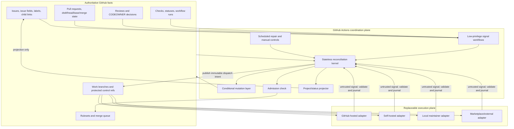

# GitHub-Native Autopilot Coordinator

| Field | Value |
| --- | --- |
| Status | Proposed |
| Date | 2026-07-28 |
| Scope | One GitHub repository |
| Decision | Build a stateless reconciliation kernel in GitHub Actions, backed only by durable GitHub facts |
| Repository audit basis | [`Jinn-Network/autopilot@60e39c9`](https://github.com/Jinn-Network/autopilot/tree/60e39c9ff98f6d9144b98c58169a905b499190ff) |
| Governing lifecycle amendment | [`assets/canon/single-surface-lifecycle.md`](https://github.com/Jinn-Network/autopilot/blob/60e39c9ff98f6d9144b98c58169a905b499190ff/assets/canon/single-surface-lifecycle.md) |
| Intended audience | Autopilot maintainers, security reviewers, workflow implementers, and executor-adapter authors |

## Document conventions

The key words **MUST**, **MUST NOT**, **SHOULD**, **SHOULD NOT**, and **MAY** are normative.

Statements about GitHub behavior are backed by official GitHub documentation. Statements about how Autopilot should use those behaviors are architectural decisions or inferences. The distinction is called out where it affects correctness.

This specification designs coordination only. It does not implement production workflows or move implementation, review, or repair execution into the coordinator.

## Goals

- Eliminate the always-running maintainer daemon as a coordination requirement.
- Make GitHub the sole durable source of shared lifecycle facts.
- Preserve lifecycle derivation, stale-writer fencing, exact-head review, idempotency, exact read-back, and native merge gates.
- Converge after duplicate, delayed, reordered, suppressed, or missing events.
- Allow implementation, review, and repair to execute on interchangeable backends.
- Remain understandable and recoverable by a repository maintainer using GitHub-native controls.
- Create a reusable single-repository installation shape without designing an organization-wide scheduler.

## Non-goals

- Replacing executor-local process supervision, temporary workspaces, or model/runtime selection.
- Treating GitHub Actions concurrency as a correctness lock.
- Treating Project Status, workflow artifacts, caches, logs, or runner filesystems as authoritative state.
- Providing exactly-once execution.
- Designing an externally hosted coordinator or GitHub App backend.
- Generalizing scheduling across repositories.

# 1. Executive verdict

Yes. Autopilot's complete coordination state machine can be GitHub-native without an always-running maintainer daemon, provided "GitHub-native" includes custom, stateless reconciliation logic executed by GitHub Actions and a GitHub App used only as an in-workflow identity/token source.

The viable design is:

> event fan-in → stateless reconciler → conditional GitHub mutations → deliberate wake-up → scheduled repair

GitHub supplies durable objects, native review and merge gates, event hints, workflow execution, and an atomic conditional Git-ref mutation API. Autopilot retains custom lifecycle derivation, deterministic scheduling, retry classification, and recovery logic, but that logic runs only when invoked and reconstructs its decisions from GitHub-visible facts.

A primitives-only design is not viable. GitHub does not natively model Autopilot's issue claim, exact-head review claim, child-remediation workflow, adapter dispatch lease, or Human overlay. Those semantics require custom reconciliation logic and machine-owned control refs.

The design does not claim exactly-once execution. Safety follows from:

1. authoritative GitHub facts,
2. compare-and-swap for exclusive ownership,
3. head-bound guards,
4. idempotent or conditionally guarded mutations,
5. exact read-back after ambiguous writes, and
6. replay until a fixed point.

# 2. Definition of “GitHub-native”

For this decision, a coordinator is GitHub-native when all of the following are true:

- GitHub stores every durable fact required to resume coordination.
- GitHub events, manual dispatch, and scheduled Actions runs provide wake-ups.
- Coordinator code runs ephemerally in GitHub Actions.
- Every invocation may start with an empty filesystem and no knowledge of previous workflow runs.
- A GitHub App may mint a short-lived installation token inside a workflow, but no App backend or other service is continuously running.
- Executors may exist outside GitHub, but they communicate through the adapter contract and do not own lifecycle decisions.
- Actions logs, caches, artifacts, workflow-run state, and runner filesystems are diagnostic or acceleration mechanisms only.
- Project Status is a projection. Human-owned issue fields remain valid inputs.
- Correctness does not depend on event delivery, event order, schedule punctuality, or Actions concurrency ordering.

This definition distinguishes two meanings of "native":

| Meaning | Use in this design |
| --- | --- |
| Native semantic primitive | GitHub itself provides the relevant guarantee, such as a review, required check, ruleset, merge queue, or conditional ref update. |
| Custom logic hosted natively | Autopilot TypeScript runs in Actions but supplies semantics GitHub does not provide, such as derived lifecycle predicates or child-remediation selection. |

The verdict is affirmative under the second, broader definition. It would be negative if "GitHub-native" meant "configuration only, with no custom reconciler."

# 3. Current daemon responsibility decomposition

## 3.1 Audited control path

The audited implementation has two generations of service code. The active v2 path starts in [`runAutopilotV2`](https://github.com/Jinn-Network/autopilot/blob/60e39c9ff98f6d9144b98c58169a905b499190ff/scripts/run-autopilot-v2.ts#L404) and defines a repeated [`runOnce`](https://github.com/Jinn-Network/autopilot/blob/60e39c9ff98f6d9144b98c58169a905b499190ff/scripts/run-autopilot-v2.ts#L767). The older service loop remains visible in [`runDaemon`](https://github.com/Jinn-Network/autopilot/blob/60e39c9ff98f6d9144b98c58169a905b499190ff/src/service.ts#L400).

The v2 path is:

1. [`runLifecycleCadence`](https://github.com/Jinn-Network/autopilot/blob/60e39c9ff98f6d9144b98c58169a905b499190ff/src/lifecycle/runner-snapshot.ts#L142) establishes incremental and full-scan cadence.
2. [`incremental-snapshot-source.ts`](https://github.com/Jinn-Network/autopilot/blob/60e39c9ff98f6d9144b98c58169a905b499190ff/src/lifecycle/incremental-snapshot-source.ts) acquires targeted evidence and falls back to authoritative full reads.
3. [`deriveLifecycle`](https://github.com/Jinn-Network/autopilot/blob/60e39c9ff98f6d9144b98c58169a905b499190ff/src/lifecycle/lifecycle.ts#L486) and [`deriveRecovery`](https://github.com/Jinn-Network/autopilot/blob/60e39c9ff98f6d9144b98c58169a905b499190ff/src/lifecycle/lifecycle.ts#L517) compute lifecycle and recovery predicates.
4. [`runLifecycleCycle`](https://github.com/Jinn-Network/autopilot/blob/60e39c9ff98f6d9144b98c58169a905b499190ff/src/lifecycle/controller.ts#L1224) plans projection and active work.
5. [`executeActivePass`](https://github.com/Jinn-Network/autopilot/blob/60e39c9ff98f6d9144b98c58169a905b499190ff/src/lifecycle/controller.ts#L1063) executes selected actions.
6. [`executeProjectionPlan`](https://github.com/Jinn-Network/autopilot/blob/60e39c9ff98f6d9144b98c58169a905b499190ff/src/lifecycle/reconciler.ts#L458) performs guarded, idempotent repair.
7. Production ports dispatch implementation, review, child issue, CI, update-branch, and merge actions.
8. [`runPaintBoard`](https://github.com/Jinn-Network/autopilot/blob/60e39c9ff98f6d9144b98c58169a905b499190ff/scripts/paint-board.ts#L328) independently projects derived state to the Project.

The current architecture already contains the main ingredients of a replayable reconciler. The daemon mostly supplies cadence, process lifetime, local capacity, and local optimization. Those responsibilities do not all belong in the coordinator.

## 3.2 Responsibility inventory

| Current responsibility | Current location or mechanism | Classification | GitHub-native disposition |
| --- | --- | --- | --- |
| Repeated cadence and process lifetime | `runAutopilotV2`, `runOnce`, `runLifecycleCadence`, older `runDaemon` | Runner-local process management | Replace with event fan-in plus scheduled repair. |
| Snapshot acquisition | `runner-snapshot.ts`, `incremental-snapshot-source.ts`, `snapshot.ts`, GitHub readers | Coordination logic | Retain as ephemeral GitHub API reads; local snapshot cache becomes optional only. |
| Rate-aware incremental reads | `incremental-snapshot-source.ts`, GitHub usage guards | Coordination logic/optimization | Retain bounded targeted reads, but require full authoritative rereads at mutation boundaries. |
| Lifecycle-state derivation | `deriveLifecycle`, `deriveRecovery` | Coordination logic | Reuse as a pure kernel in Actions. |
| Eligibility and priority | `active-scheduler.ts::scheduleActiveActions` | Coordination logic | Reuse with deterministic ordering and bounded scope. |
| Implementation publisher claim | `autopilot/<issue>` branch protocol and terminal-claim evidence | Durable shared state | Retain existing work-branch/ref protocol. |
| Review claim | `refs/jinn-autopilot/review-claims/v1/<pr>` and exact-head checks | Durable shared state | Migrate to protected machine-owned control branches using conditional `updateRefs`. |
| Stale-writer fencing | `git-protocol.ts`, `--force-with-lease`, candidate-parent verification | Coordination logic plus durable ref state | Retain semantics; use atomic GraphQL conditional ref mutation where available. |
| Idempotent projection repair | `reconciler.ts` | Coordination logic | Retain; execute after exact reread in Actions. |
| Project Status painting | `projection.ts`, `board-painter.ts`, `paint-board.ts` | Projection/observability | Keep in a separate low-priority projector workflow. Never use as authority. |
| Human triage inputs | Project fields and issue metadata | Durable human input | Prefer native issue fields as inputs; temporarily support existing Project fields during migration. |
| Implementation execution | `implementation-executor*.ts`, implementation session modules | Execution-adapter behavior | Move behind the adapter contract. |
| Review execution | `review-executor*.ts`, review session modules | Execution-adapter behavior | Move behind a separately credentialed reviewer adapter. |
| Child remediation | `child-issues*.ts`, review follow-up modules | Coordination logic plus execution | Coordinator decides and creates the child; adapter performs remediation. |
| CI failure classification and retry | `ci-classifier.ts`, `ci-rerun*.ts` | Coordination logic plus mutation | Retain classification and one-shot retry ledger in control refs. |
| Update branch and reconciliation | `merge-executor*.ts`, reconciliation writer | Coordination logic plus execution | Prefer native update-branch API; dispatch conflict resolution as child work. |
| Merge sweep and batching | merge executor and legacy dispatcher merge/stack sweeps | Coordination logic/legacy custom mechanism | Replace root-PR admission and batching with native merge queue where supported. |
| Stacked-PR ordering | legacy stack modules plus lifecycle guards | Coordination logic | Retain custom parent/child readiness; do not enqueue non-root stack PRs. |
| Capability attestation | `capability-attestation.ts` v2, local environment/path, 30-day age | Durable-looking local configuration | Move proof to a protected capability control ref; local copy may be cached only. |
| Marketplace routing | `dispatcher/marketplace-route.ts`, labels, comments, local journals | Execution-adapter behavior | Keep route selection out of lifecycle authority; journal accepted signals in GitHub control refs. |
| Workspace/PID/process cleanup | `attempt-workspace.ts`, production runtime PID supervision | Runner-local process management | Keep inside local/self-hosted adapters. |
| Local retry and session journals | dispatcher/session runtime files | Execution-adapter behavior | Keep only for adapter recovery; they cannot prove lifecycle completion. |
| Project-owned mutable lifecycle decision state | superseded behavior prohibited by `single-surface-lifecycle.md` | Legacy behavior no longer required | Delete after compatibility period. |

## 3.3 Invariants already worth preserving

The current implementation and lifecycle amendment already establish the correct distributed-systems posture:

- lifecycle phases are derived rather than written;
- Project Status is painter-owned projection;
- claims and reviews are bound to immutable Git objects or exact PR heads;
- writes use expected-old semantics and exact read-back;
- recovery is based on current GitHub facts;
- child issues represent review, reconciliation, or CI remediation;
- merge is pinned to the reviewed head; and
- local state is not the shared authority.

The GitHub-native design changes where the kernel is invoked, not those semantics.

# 4. GitHub capability matrix

The classification column uses the required categories. “Custom logic hosted in Actions” means GitHub runs the code but does not supply the semantic guarantee.

| Responsibility or invariant | Current Autopilot mechanism | Candidate GitHub primitive | Exact useful guarantee | Important limitations | Permission/plan | Classification | Confidence | Evidence |
| --- | --- | --- | --- | --- | --- | --- | --- | --- |
| Event detection | Daemon polls GitHub | Actions repository events | Starts workflows for documented activity types | Events are hints; token-created events are often suppressed; no ordering guarantee should be assumed | Workflow present on default branch; event-specific token permissions | Replaced natively | High | [Events that trigger workflows](https://docs.github.com/en/actions/reference/workflows-and-actions/events-that-trigger-workflows), [webhook troubleshooting](https://docs.github.com/en/webhooks/testing-and-troubleshooting-webhooks/troubleshooting-webhooks) |
| Repair wake-up | Full reconcile cadence | `schedule` | Periodic workflow invocation; minimum interval is five minutes | Can be delayed or dropped under load; public-repo schedules may disable after 60 days of inactivity | Actions enabled; default-branch workflow | Replaced natively | High | [Scheduled events](https://docs.github.com/en/actions/reference/workflows-and-actions/events-that-trigger-workflows#schedule) |
| Manual retry | Local operator reruns process | `workflow_dispatch` and workflow rerun | Explicit operator-controlled invocation | Rerun uses workflow semantics associated with the run; reruns are limited | Actions write/run access | Replaced natively | High | [Workflow dispatch and rerun events](https://docs.github.com/en/actions/reference/workflows-and-actions/events-that-trigger-workflows) |
| Lifecycle derivation | Pure TypeScript predicates | Actions-hosted shared kernel | Executes arbitrary bounded coordinator code | GitHub supplies compute, not lifecycle semantics | `contents:read`, `issues:read`, `pull-requests:read`, `checks:read` | Custom logic hosted in Actions | High | [Workflow syntax](https://docs.github.com/en/actions/reference/workflows-and-actions/workflow-syntax) |
| Project Status non-authority | Dedicated painter | Projects API and Projects v2 events | Stores and exposes a maintainer-visible projection | Projects item webhooks are preview and are not direct Actions triggers; Project fields lack CAS semantics | Project read/write token, often App or PAT | Replaced natively for projection only | High | [Projects webhook payload](https://docs.github.com/en/webhooks/webhook-events-and-payloads#projects_v2_item), [Project automation](https://docs.github.com/en/issues/planning-and-tracking-with-projects/automating-your-project) |
| Human triage input | Project fields | Native issue fields | Durable issue metadata accessible through APIs and visible in Projects | Feature availability and field events must be validated in the target repository | Issues read/write as appropriate | Replaced natively | Medium-high | [Issue fields](https://docs.github.com/en/issues/tracking-your-work-with-issues/using-issues/adding-and-managing-issue-fields) |
| One implementation publisher | Work branch claim with lease discipline | Protected `autopilot/<issue>` branch plus conditional ref mutation | A single expected old OID can win an atomic ref transition | GitHub does not provide the lifecycle lease; protection/ruleset interaction needs a spike | App `contents:write`; suitable plan for private-repo rulesets | Existing Git-ref protocol retained | High | [GraphQL Git mutations](https://docs.github.com/en/graphql/reference/git), [rulesets](https://docs.github.com/en/repositories/configuring-branches-and-merges-in-your-repository/managing-rulesets/about-rulesets) |
| Exact-head review claim | Custom review ref | Protected review control ref using `updateRefs.beforeOid` | Conditional update fails if the ref is no longer at the expected OID; multiple ref updates can be atomic | The record schema and expiry semantics remain custom | Reviewer/coordinator App `contents:write` | Existing Git-ref protocol retained | High | [GraphQL `updateRefs`](https://docs.github.com/en/graphql/reference/git) |
| Multi-ref atomic handoff | Force-with-lease operations | GraphQL `updateRefs` | Atomic all-or-nothing conditional updates over multiple refs | Requires GraphQL and exact OIDs; REST refs do not offer expected-old CAS | App `contents:write` | Replaced natively at mutation layer | High | [GraphQL Git mutations](https://docs.github.com/en/graphql/reference/git), [REST Git refs](https://docs.github.com/en/rest/git/refs) |
| Duplicate suppression | Local action ledger plus read-back | Natural keys, issue/PR searches, control refs | Durable objects can be reread and matched to deterministic identities | Search/index latency means exact object reads are preferred after mutation | Object-specific read permissions | Custom logic hosted in Actions | High | [REST API best practices](https://docs.github.com/en/rest/using-the-rest-api/best-practices-for-using-the-rest-api) |
| Coordinator mutual exclusion | Single daemon process | Actions concurrency group | Limits running/pending jobs in a group and can cancel or replace queued work | Ordering is not guaranteed; a pending run may replace an older pending run; repository-local convenience only | No special API permission | Semantically weakened if used alone; convenience only in this design | High | [Workflow concurrency](https://docs.github.com/en/actions/how-tos/write-workflows/choose-when-workflows-run/control-workflow-concurrency) |
| Durable dispatch intent | In-process/session journals | Machine-owned dispatch control ref | Ref and commit remain repository-visible and CAS-updatable | GitHub has no native executor-intent object | Coordinator App `contents:write` | Custom logic hosted in Actions | High | [GraphQL Git mutations](https://docs.github.com/en/graphql/reference/git) |
| Executor acknowledgement | Session-local state | Adapter signal plus coordinator-journaled ref and optional check run | Acknowledgement becomes durable only after the coordinator validates and journals it | Check runs cannot be the only authority and may not wake another workflow when created with `GITHUB_TOKEN` | App token; checks write for check runs | Custom logic hosted in Actions | Medium-high | [Checks API](https://docs.github.com/en/rest/guides/using-the-rest-api-to-interact-with-checks), [`GITHUB_TOKEN`](https://docs.github.com/en/actions/concepts/security/github_token) |
| Child remediation | Machine child markers | Issues, sub-issues, dependencies, deterministic marker | Durable issue relationship and visible work item | Up to 100 direct sub-issues and eight levels; semantics still custom | `issues:write` | Custom logic hosted in Actions | High | [Sub-issues](https://docs.github.com/en/issues/tracking-your-work-with-issues/using-issues/adding-sub-issues), [issue dependencies](https://docs.github.com/en/issues/tracking-your-work-with-issues/using-issues/creating-issue-dependencies) |
| Review verdict | Review executor plus exact-head claim | Native PR review with submitted `commit_id` | Review is recorded on a PR and associated with a commit; rules can dismiss stale approvals | Bot identity and CODEOWNER eligibility must be configured; current-requested-changes semantics require exact reread | `pull-requests:write`; branch protection/ruleset | Replaced natively for verdict; claim remains custom | High | [Pull request reviews API](https://docs.github.com/en/rest/pulls/reviews), [required reviews](https://docs.github.com/en/pull-requests/how-tos/review-pull-requests/approving-a-pull-request-with-required-reviews) |
| CODEOWNER/human gates | Current native gates plus custom derivation | CODEOWNERS, required reviews, rulesets | GitHub blocks merge until configured native requirements pass | Availability varies by plan/repository visibility; bypass actors must be tightly constrained | Repository administration; appropriate plan | Replaced natively | High | [Ruleset rules](https://docs.github.com/en/repositories/configuring-branches-and-merges-in-your-repository/managing-rulesets/available-rules-for-rulesets) |
| CI state | Check/status readers | Check suites, check runs, commit statuses, workflow runs | Native status is attached to a commit and required gates can enforce it | Old required-check identities can be retained; skipped/neutral semantics need explicit policy; check data has retention behavior | `checks:read`, `statuses:read`, `actions:read` | Replaced natively | High | [Status checks](https://docs.github.com/en/pull-requests/reference/status-checks), [troubleshooting required checks](https://docs.github.com/en/pull-requests/how-tos/merge-and-close-pull-requests/troubleshooting-required-status-checks) |
| One CI rerun | Local retry record | Per-head control ref plus Actions rerun API | Durable CAS record prevents a second coordinator-authorized retry for the same head | GitHub's rerun API itself is not a per-head CAS ledger; runs have a rerun limit | `actions:write`, App `contents:write` | Custom logic hosted in Actions | High | [Actions limits](https://docs.github.com/en/actions/reference/limits) |
| Update branch | Merge executor | Update-a-pull-request-branch API with `expected_head_sha` | Rejects a stale request when the expected head no longer matches | Asynchronous `202`; conflicts still require remediation | `pull-requests:write`/contents as documented | Replaced natively for clean update | High | [Pull requests REST API](https://docs.github.com/en/rest/pulls/pulls#update-a-pull-request-branch) |
| Root PR admission and batching | Custom merge sweep/batch | Native merge queue and `merge_group` | Revalidates required checks against merge-group commits and serializes/batches admission under repository policy | Plan/repository constraints; non-root stack PRs do not fit the main-branch queue; queue can eject entries | Branch settings; `pull-requests:write`; eligible plan | Replaced natively for root PRs | High | [Managing a merge queue](https://docs.github.com/en/repositories/configuring-branches-and-merges-in-your-repository/configuring-pull-request-merges/managing-a-merge-queue), [merging with a merge queue](https://docs.github.com/en/pull-requests/collaborating-with-pull-requests/incorporating-changes-from-a-pull-request/merging-a-pull-request-with-a-merge-queue) |
| Head-pinned queue admission | Custom merge head guard | GraphQL `enqueuePullRequest(expectedHeadOid: ...)` | Admission can be conditioned on the expected PR head | Queue processing subsequently creates merge-group commits; branch movement is normal, not failure | App pull-request write; merge queue enabled | Replaced natively | High | [GraphQL `EnqueuePullRequestInput`](https://docs.github.com/en/enterprise-cloud@latest/graphql/reference/pulls#enqueuepullrequestinput) |
| Human hold | Human overlay in derived state | Label or native issue field plus required admission check | Durable, visible input can make the Autopilot admission check fail | GitHub has no universal “hold” lifecycle meaning; a narrow race remains after admission unless dequeue is also performed | `issues:write`/`pull-requests:write`, checks write | Custom logic hosted in Actions | High | [Required status checks](https://docs.github.com/en/repositories/configuring-branches-and-merges-in-your-repository/managing-protected-branches/about-protected-branches) |
| Capability proof | Local 30-day attestation | Protected capabilities control ref plus scheduled probe | Durable versioned proof is available to every invocation | Actual capability semantics remain custom; proof can become stale | App `contents:write`; probe-specific permissions | Custom logic hosted in Actions | High | [Git refs](https://docs.github.com/en/graphql/reference/git) |
| Long-term workflow state | Local files | GitHub objects and control refs | Durable repository-visible record | Workflow artifacts default to finite retention; caches may be evicted after inactivity and are mutable by key semantics | Actions permissions | Artifacts/caches unsupported as authority | High | [Dependency caching](https://docs.github.com/en/actions/reference/workflows-and-actions/dependency-caching), [artifact retention/removal](https://docs.github.com/en/actions/how-tos/manage-workflow-runs/remove-workflow-artifacts) |
| Token-scoped write identity | Local credentials | `GITHUB_TOKEN` or in-workflow App installation token | Job-scoped repository token; App installation token expires after one hour | `GITHUB_TOKEN` recursion suppression; token permissions and fork behavior vary; App installation must be scoped | Explicit minimal permissions; App installation | Replaced natively | High | [`GITHUB_TOKEN`](https://docs.github.com/en/actions/concepts/security/github_token), [App installation tokens](https://docs.github.com/en/apps/creating-github-apps/authenticating-with-a-github-app/generating-an-installation-access-token-for-a-github-app) |
| Replaceable executor | Production runtime ports | Reusable workflow/action, self-hosted runner, local or external adapter | GitHub can dispatch to hosted or self-hosted jobs; reusable workflows cannot elevate caller permissions | Self-hosted trust and queue expiry; external completion transport remains custom | Adapter-specific | Custom logic hosted in Actions | High | [Reusable workflows](https://docs.github.com/en/actions/reference/workflows-and-actions/reusing-workflow-configurations), [self-hosted runners](https://docs.github.com/en/actions/concepts/runners/self-hosted-runners) |
| Rate-aware operation | Local GraphQL budget guards | REST/GraphQL rate metadata and bounded reconciliation | APIs publish primary and secondary limits and response metadata | Limits differ by token type and installation scale; reconciliation must degrade gracefully | Any API token | Custom logic hosted in Actions | High | [GraphQL limits](https://docs.github.com/en/graphql/overview/rate-limits-and-query-limits-for-the-graphql-api), [REST limits](https://docs.github.com/en/rest/using-the-rest-api/rate-limits-for-the-rest-api) |
| Workflow duration/queue safety | Always-running daemon | Ephemeral Actions jobs | Hosted jobs may run for up to six hours; self-hosted jobs up to five days; queue and concurrency limits are documented | Not suitable as a durable lease or indefinite executor wait | Actions availability/billing | Semantically weakened if execution blocks; safe when coordinator only dispatches | High | [Actions limits](https://docs.github.com/en/actions/reference/limits), [Actions billing](https://docs.github.com/en/actions/concepts/billing-and-usage) |

## 4.1 Capability boundary

GitHub has all required storage and admission primitives, but not all lifecycle semantics. The two correctness-critical primitives are:

1. native pull-request/review/check/ruleset/merge-queue facts; and
2. atomic conditional Git-ref mutation.

Actions events and concurrency improve responsiveness and reduce overlap. They are not the basis of correctness.

## 4.2 Platform constraints applied by this design

| Platform behavior or limit | Verified current semantics | Design consequence | Evidence |
| --- | --- | --- | --- |
| Event coverage | Not every webhook event has a corresponding Actions trigger; many event workflows must exist on the default branch | The coordinator accepts several Actions triggers plus schedule, but can also ingest an authenticated `repository_dispatch` scope hint | [Events that trigger workflows](https://docs.github.com/en/actions/reference/workflows-and-actions/events-that-trigger-workflows) |
| Check events | `check_run`/`check_suite` do not trigger workflows when the suite was created by GitHub Actions or its head SHA is associated with Actions | CI completion is also observed through `workflow_run`, exact status rereads, self-kicks, and schedule | [Check-run and check-suite events](https://docs.github.com/en/actions/reference/workflows-and-actions/events-that-trigger-workflows#check_run) |
| `workflow_run` privilege and depth | The downstream workflow can access secrets/write tokens even when the upstream workflow could not; chains longer than three levels do not run | Use one low-privilege signal → one privileged reconcile hop, never a workflow chain as state-machine storage | [`workflow_run`](https://docs.github.com/en/actions/reference/workflows-and-actions/events-that-trigger-workflows#workflow_run) |
| `GITHUB_TOKEN` recursion | Token-caused events usually do not start workflows; `workflow_dispatch` and `repository_dispatch` are exceptions, while token-created PR opened/synchronize/reopened runs require approval | Use explicit dispatch for continuations and an App token for coordinator writes; never wait for an incidental mutation event | [`GITHUB_TOKEN` event behavior](https://docs.github.com/en/actions/concepts/security/github_token#when-github_token-triggers-workflow-runs) |
| Schedule | Minimum interval is five minutes; default branch only; runs can be delayed or dropped; public-repository schedules disable after 60 days without activity | Schedule is repair, not a lease timer or latency guarantee; monitor last full scan and provide manual dispatch | [`schedule`](https://docs.github.com/en/actions/reference/workflows-and-actions/events-that-trigger-workflows#schedule) |
| Concurrency | Default `queue: single` retains at most one pending run and replaces an older pending run; `queue: max` retains up to 100; actual processing order is not guaranteed | Use default single queue only to coalesce hints; all safety remains in CAS and exact-head guards | [Workflow concurrency](https://docs.github.com/en/actions/how-tos/write-workflows/choose-when-workflows-run/control-workflow-concurrency) |
| Workflow/job duration | Workflow run: 35 days including waits; hosted job: six hours; self-hosted job: five days; self-hosted queue: 24 hours; reruns: 50 | Coordinator passes are minutes, never wait for executors, and expire/reoffer work after durable deadlines | [Actions limits](https://docs.github.com/en/actions/reference/limits) |
| Trigger/queue limits | 1,500 workflow-trigger events per 10 seconds per repository; 500 workflow runs queued per 10 seconds; `queue:max` concurrency groups cap at 100 | Coalesce event hints, bound self-kicks, and prefer one scoped pass over transition-workflow fan-out | [Actions limits](https://docs.github.com/en/actions/reference/limits) |
| API rate limits | `GITHUB_TOKEN`: 1,000 requests/hour/repository, or 15,000 for Enterprise Cloud resources; App installation: at least 5,000/hour, 15,000 on Enterprise Cloud, otherwise scales up to 12,500 | Use installation tokens for mutation, targeted reads for common paths, full scans off the top of the hour, and hard rate reserves | [Actions and dependent API limits](https://docs.github.com/en/actions/reference/limits#commonly-hit-dependent-service-limits) |
| App token lifetime | Installation access tokens expire after one hour | Mint per job; no coordinator action may assume the token survives between runs | [Generating installation access tokens](https://docs.github.com/en/apps/creating-github-apps/authenticating-with-a-github-app/generating-an-installation-access-token-for-a-github-app) |
| Cache retention/security | Unaccessed cache entries are removed after seven days; caches are readable from pull requests against the base branch; default repository capacity is 10 GB | Caches may accelerate dependencies only and MUST contain neither authoritative state nor secrets | [Dependency cache eviction and security](https://docs.github.com/en/actions/reference/workflows-and-actions/dependency-caching#usage-limits-and-eviction-policy) |
| Artifact/log retention | Build logs and artifacts default to 90 days and can be deleted or reconfigured | Artifacts are diagnostics only; a required recovery fact must also be written to a durable GitHub object/ref | [Artifact retention](https://docs.github.com/en/actions/how-tos/manage-workflow-runs/remove-workflow-artifacts) |
| Repository/environment variables | Variables are mutable configuration values; their REST APIs do not expose an expected-old conditional update primitive | Variables MAY hold non-authoritative tuning, never claims, leases, generations, or state transitions | [Actions variables API](https://docs.github.com/en/rest/actions/variables) |
| Environments | Environments can gate jobs with approval and scope secrets; a workflow may wait up to 30 days for environment approval | Use environments to protect role credentials, not to represent lifecycle or long-running adapter acceptance | [Deployment environments](https://docs.github.com/en/actions/concepts/workflows-and-actions/deployment-environments), [Actions limits](https://docs.github.com/en/actions/reference/limits) |
| Deployments | Deployments/statuses provide an environment-oriented record but not expected-old CAS; inactive deployment statuses do not trigger an Actions workflow | They MAY project execution activity but do not replace dispatch/control refs | [Deployment-status API](https://docs.github.com/en/rest/deployments/statuses), [deployment events](https://docs.github.com/en/actions/reference/workflows-and-actions/events-that-trigger-workflows#deployment_status) |
| Ruleset availability | Rulesets are available in public repositories on Free and in public/private repositories on Pro, Team, and Enterprise Cloud; multiple matching rulesets aggregate and the most restrictive form applies | Validate plan/visibility, use layered ref-specific rulesets, and avoid accidental product-branch bypass | [About rulesets](https://docs.github.com/en/repositories/configuring-branches-and-merges-in-your-repository/managing-rulesets/about-rulesets) |
| Merge-queue availability and scale | Available for organization-owned public repositories and private repositories on Enterprise Cloud; build concurrency and merge limits are configurable from 1 to 100 | Capability probe gates adoption; default conservative group/concurrency settings are tuned after canary | [Managing a merge queue](https://docs.github.com/en/repositories/configuring-branches-and-merges-in-your-repository/configuring-pull-request-merges/managing-a-merge-queue) |

# 5. Architectural alternatives and trade-offs

| Criterion | A. Shared reconciliation kernel | B. Transition-specific workflows | C. GitHub-primitives-first/minimal kernel |
| --- | --- | --- | --- |
| Correctness under missing/reordered events | Strong: every invocation rereads and derives | Weak-medium: transitions can disagree or omit repair paths | Medium: strong only for semantics GitHub natively models |
| Crash recovery | Strong: replay from GitHub facts | Medium: each workflow needs bespoke recovery | Medium: native primitives recover; custom gaps remain |
| Stale-writer fencing | Centralized CAS protocol | Easy to implement inconsistently | Unsupported for custom claims without adding refs |
| Security separation | Clear workflow identities and adapter ports | Many credentials and trust boundaries | Simple, but insufficient for executor/reviewer separation |
| Latency | Event-driven; usually one or two runs | Event-driven; lowest best-case latency | Event-driven |
| Actions/rate cost | Moderate and controllable with scoped reads | Potentially high duplicate reads and cross-trigger churn | Lowest |
| Reasoning and testing | One pure model and mutation algebra | State machine fragmented across YAML and scripts | Simple until custom lifecycle cases appear |
| Operator experience | One reconciliation report and consistent controls | Failures scattered across workflows | Native UI is good but incomplete |
| Portability | Shared action/reusable workflow package | Workflow sprawl is harder to version | High for basic lifecycle only |
| Migration risk | Lowest: reuses current pure lifecycle core | High: simultaneous semantic rewrite | High: discards proven custom invariants |
| Custom machinery retained | Moderate, focused in kernel | Similar amount, fragmented | Low, but only by weakening or dropping semantics |

## 5.1 Rejected: separate transition-specific workflows

Transition-specific workflows appear natural because GitHub exposes many event types. They fail under this system's fault model: an event can be delayed, reordered, missing, or suppressed. Each transition workflow would need to reread the same complete facts, rediscover partial work, and implement the same fencing rules. That reconstructs a reconciler in fragments while making invariant drift more likely.

Transition-specific workflows MAY remain as low-privilege signal collectors, but they MUST NOT independently implement lifecycle decisions.

## 5.2 Rejected: primitives-only

Native issues, reviews, checks, rulesets, and merge queue should be used aggressively. They cannot express:

- exclusive implementation publishing before a PR exists;
- reviewer reservation bound to an exact head;
- deterministic child-remediation identity;
- adapter dispatch/acknowledgement and replacement fencing;
- one-shot CI retry per exact head;
- Human overlay semantics across issue, PR, and child work; or
- safe dual-coordinator cutover.

Dropping these behaviors would semantically weaken the current system.

## 5.3 Recommended: shared kernel with native gates

Use architecture A as a hybrid:

- one shared pure reconciliation kernel;
- several event-fan-in workflows with sharply separated credentials;
- GitHub-native reviews, checks, rulesets, and merge queue;
- protected control refs for semantics GitHub does not provide;
- scheduled repair; and
- execution adapters outside the coordination kernel.

# 6. Recommended architecture



## 6.1 Component responsibilities

### Signal workflows

Signal workflows normalize wake-up metadata and invoke or dispatch the coordinator. They MUST NOT decide a lifecycle transition. A low-privilege signal run MAY process an untrusted PR event, but a later privileged workflow MUST reread the PR by repository and number.

### Reconciliation kernel

The kernel:

- reads authoritative GitHub facts;
- derives current lifecycle predicates;
- calculates deterministic candidate actions;
- orders them by fixed priority;
- executes at most a bounded number of guarded mutations;
- rereads after each mutation;
- records a durable failure or hold when automatic progress is unsafe; and
- schedules another wake-up when work may remain.

The kernel MUST NOT execute untrusted repository content.

### Conditional mutation layer

This layer exposes typed operations such as `tryCreateClaim`, `tryReplaceReviewClaim`, `ensureChildIssue`, `recordDispatch`, `enqueueExpectedHead`, and `setAdmissionCheck`. Each operation defines:

- its natural idempotency key;
- the exact facts reread immediately before mutation;
- its expected-old/CAS guard;
- success evidence;
- ambiguous-write read-back; and
- retry classification.

### Projector

The projector writes operator-visible status, explanations, and timestamps. It cannot enable work or prove completion.

### Execution adapters

Adapters accept immutable work identities, execute work, and report observations. They do not select issues, set lifecycle state, replace claims, approve their own implementation, or merge.

# 7. Authoritative state and schemas

## 7.1 Source-of-truth table

| GitHub object | Authoritative meaning | Non-authoritative uses |
| --- | --- | --- |
| Issue open/closed state | Work item exists or is complete/abandoned according to policy | Project row presence |
| Human-owned issue fields | Priority, size, routing, or explicit human input | Machine phase |
| `autopilot:human-hold` label | Deliberate Human overlay is active | Comment text alone |
| PR head/base/draft/open/merged state | Delivery and merge facts | Project Status |
| Native review with commit association | Review verdict for the associated head, subject to current rules | Review summary comment |
| Required checks/statuses | CI/admission facts for the exact commit | Workflow log |
| `refs/heads/autopilot/<issue>` | Current implementation work and authoritative publisher lineage | Runner workspace |
| `refs/heads/autopilot-control/reviews/<pr>` | Reviewer claim for an exact PR head | In-progress review check |
| `refs/heads/autopilot-control/dispatch/<dispatch-id>` | Coordinator-journaled intent and accepted adapter observations | Adapter-local journal |
| `refs/heads/autopilot-control/ci-reruns/<pr>/<head>` | Per-head CI retry authorization/consumption | Rerun attempt number alone |
| `refs/heads/autopilot-control/owner` | Which coordinator generation may mutate during migration or rollback | Workflow concurrency group |
| `refs/heads/autopilot-control/capabilities` | Latest verified capability attestation | Local environment file |
| Native merge-queue entry | Root PR has been admitted to the target branch queue | “merge-ready” projection |
| Deterministic child issue marker and native relation | Remediation work exists for parent PR/head/kind | Similar issue title |
| Coordinator-owned admission check | Current derived admission result for an exact head/merge group | Durable lifecycle storage |
| Project Status and explanatory fields | Projection for humans | Any scheduling or ownership decision |

## 7.2 Control-ref representation

Each `autopilot-control/*` ref is a branch ref pointing to a commit. The commit tree contains one canonical UTF-8 JSON file at `record.json`. The commit:

- has one parent for an update and no parent for initial creation;
- includes the SHA-256 digest of canonical `record.json` in the message;
- is signed when repository policy supports verifiable bot signatures;
- is created from no untrusted repository content; and
- is advanced only through GraphQL `updateRefs` with `beforeOid`.

The record envelope is:

```json
{
  "schema": "jinn.autopilot.control/v1",
  "kind": "review-claim",
  "recordId": "pr:431:head:8f6f…",
  "generation": 3,
  "createdAt": "2026-07-28T10:00:00.000Z",
  "updatedAt": "2026-07-28T10:01:20.000Z",
  "writer": {
    "appSlug": "jinn-autopilot-coordinator",
    "installationId": 12345,
    "workflowRunId": 98765
  },
  "payload": {}
}
```

Timestamps inform staleness policy but never order competing writers. OIDs, generations, exact heads, and CAS guards determine validity.

## 7.3 Implementation claim

The existing `refs/heads/autopilot/<issue>` work branch remains the implementation claim and publication surface during migration. Its authoritative claim commit MUST identify:

```json
{
  "schema": "jinn.autopilot.implementation-claim/v1",
  "issue": 123,
  "baseRef": "refs/heads/main",
  "baseOid": "40-hex-object-id",
  "attemptId": "issue-123/generation-7",
  "publisherIdentity": "jinn-autopilot-implementer",
  "createdAt": "2026-07-28T10:00:00.000Z"
}
```

Rules:

- Initial claim creation MUST be conditional on the branch being absent.
- Replacement MUST require the exact current claim OID and a policy-permitted stale state.
- A publisher MUST reread the remote ref before each push.
- Published history MUST be append-only. A replacement may advance through an explicit handoff commit but MUST NOT erase published commits.
- Completion from a replaced `attemptId` MUST be rejected even if its executor reports success.

## 7.4 Review claim

`refs/heads/autopilot-control/reviews/<pr>` contains:

```json
{
  "schema": "jinn.autopilot.review-claim/v1",
  "pr": 431,
  "headOid": "40-hex-object-id",
  "attemptId": "review:431:8f6f…:2",
  "reviewerIdentity": "jinn-autopilot-reviewer",
  "state": "claimed",
  "claimedAt": "2026-07-28T10:00:00.000Z",
  "expiresAt": "2026-07-28T10:30:00.000Z",
  "supersedes": "optional-prior-record-id"
}
```

A claim is valid only while the PR is open, its current head equals `headOid`, the reviewer identity remains allowed, and the claim has not been replaced. Review submission MUST include the exact commit ID and MUST reread the PR head immediately before submission.

## 7.5 Dispatch journal

`refs/heads/autopilot-control/dispatch/<dispatch-id>` is an append-only state journal controlled by the coordinator:

```json
{
  "schema": "jinn.autopilot.dispatch/v1",
  "dispatchId": "01J…",
  "work": {
    "kind": "implementation",
    "issue": 123,
    "pr": null,
    "expectedHeadOid": "40-hex-object-id",
    "claimRecordId": "issue-123/generation-7"
  },
  "adapter": "github-hosted",
  "state": "offered",
  "offer": 1,
  "deadline": "2026-07-28T10:10:00.000Z",
  "lastAcceptedSignal": null,
  "result": null
}
```

Allowed coordinator-journaled states are:

```text
offered → accepted → running → succeeded
        ↘ refused
        ↘ expired → superseded
accepted/running → failed | canceled | stale | superseded
```

Adapters MUST NOT receive `contents:write` to control refs. They report a signed or authenticated signal containing the dispatch ID, attempt ID, expected head, result digest, and monotonically increasing adapter sequence. The coordinator validates the signal against current GitHub facts and appends the accepted observation by CAS. Duplicate signals are harmless.

## 7.6 Child-remediation identity

Each machine child MUST contain exactly one canonical marker:

```html
<!-- jinn-autopilot:child parent-pr=431 parent-head=8f6f... kind=review-finding key=sha256:... -->
```

Allowed `kind` values:

- `review-finding`
- `reconcile`
- `ci-failure`

The natural key is `(parent PR, parent head, kind, normalized finding key)`. The coordinator MUST search and exact-read before creating a child. Only one open child may own a natural key. Native sub-issue/dependency relationships SHOULD also be set, but the marker remains the compatibility identity.

## 7.7 Human overlay

The Human overlay is active when any of these authoritative conditions hold:

- `autopilot:human-hold` is present on the issue or PR;
- the configured human-control issue field has the hold value;
- a transition has reached a terminal automatic-retry policy and the coordinator has created a canonical escalation marker; or
- an operator has invoked emergency pause.

Clearing Human requires a deliberate label/field change or a typed `workflow_dispatch` control operation. Closing a discussion or rerunning a failed job is not sufficient.

## 7.8 Project projection

The projector MAY write:

- derived phase;
- blocking reason;
- active claim/dispatch age;
- last reconciliation time;
- last successful transition;
- next eligible automatic action; and
- current Human overlay.

The reconciler MUST produce the same decisions if all projected fields are missing or stale.

# 8. Reconciliation algorithm

## 8.1 Wake-up sources

The coordinator is awakened by:

- trusted `issues`, `pull_request`, `check_run`, `check_suite`, `status`, `push`, and `merge_group` events where safe;
- completed low-privilege signal workflows through `workflow_run`;
- `repository_dispatch` for deliberate self-kicks and authenticated adapter signals;
- `workflow_dispatch` for operator controls;
- a scheduled full repair scan; and
- completion of coordinator-owned execution workflows.

Events carry only scope hints such as issue number, PR number, or head OID. No event payload is accepted as current authority.

## 8.2 Deterministic planning rules

Each invocation MUST:

1. Resolve the active owner record.
2. Refuse mutation unless its coordinator generation owns `autopilot-control/owner`.
3. Convert the wake-up into a bounded candidate scope.
4. Reread current issue, PR, review, check, ref, queue, and child facts for that scope.
5. Validate schema versions and capability attestation.
6. Derive lifecycle predicates through the shared pure kernel.
7. Construct actions with stable natural keys.
8. Sort actions by a versioned total ordering.
9. Execute one guarded action.
10. Reread and rederive before considering another action.
11. Stop after the action budget, time budget, rate reserve, or a fixed point.
12. If work may remain, publish a deliberate self-kick using a token that can trigger the target event.

Recommended initial budgets are eight mutations, five minutes of wall time, and a configurable REST/GraphQL reserve. The limits are operational settings, not semantic constants.

## 8.3 Action ordering

The v1 total ordering is:

1. emergency disable and Human overlay;
2. invalidate stale claims or exact-head records;
3. record accepted executor observations;
4. repair partial publication;
5. create or update native child relationships;
6. native review/check projection;
7. update branch or dispatch remediation;
8. new implementation/review/repair claims;
9. dispatch;
10. merge admission;
11. terminal cleanup;
12. operator projection.

This ordering prevents new work from outrunning safety repairs.

## 8.4 Pseudocode

```text
reconcile(wakeHint):
  deadline = now + ACTION_WALL_BUDGET
  mutationCount = 0
  scope = normalizeHint(wakeHint)

  owner = readExact(controlRef("owner"))
  if owner.generation != THIS_COORDINATOR_GENERATION:
    return report("observe-only: coordinator does not own mutations")

  while mutationCount < MAX_MUTATIONS and now < deadline:
    capabilities = readExact(controlRef("capabilities"))
    assertCapabilitiesFreshOrFailClosed(capabilities)

    facts = readAuthoritativeFacts(scope)
    validateFacts(facts)
    model = deriveLifecycle(facts, exactNow())
    actions = deterministicPlan(model)
    action = first(sortByVersionedPriority(actions))

    if action is none:
      ensureAdmissionAndProjectionAreConsistent(model)
      return report("fixed point")

    guardFacts = rereadMutationBoundary(action)
    if not action.guard(guardFacts):
      continue

    try:
      result = executeConditionalMutation(action, guardFacts)
    catch ambiguousTransportFailure:
      result = exactReadBack(action.successEvidence)
      if result does not prove success:
        recordRetryableFailure(action)
        requestSelfKick(scope)
        return report("ambiguous write unresolved")
    catch permanentOrUnsafeFailure:
      ensureHumanEscalation(action)
      return report("human escalation")

    mutationCount += 1
    scope = expandScopeFrom(result)

  requestSelfKick(scope)
  return report("budget exhausted; continuation requested")
```

## 8.5 Partial success and ambiguous writes

Multi-step effects MUST be decomposed into individually observable mutations. For example, creating a child issue and attaching it as a sub-issue are two actions. If the workflow stops between them, the next run discovers the canonical marker and repairs the relation.

After a timeout or connection loss, the coordinator MUST NOT blindly retry. It rereads the exact natural key:

- ref OID for a ref mutation;
- issue/PR number and canonical marker for object creation;
- submitted review ID and commit ID for a review;
- check run external ID for a check;
- merge-queue membership and expected head for enqueue; or
- workflow dispatch ledger for execution.

## 8.6 Self-kicks and recursion suppression

Mutations made with `GITHUB_TOKEN` generally do not create new workflow runs, except for `workflow_dispatch` and `repository_dispatch`. Therefore:

- normal progress MUST NOT depend on a mutation-generated event;
- after a bounded pass that may have enabled another action, the coordinator SHOULD send `repository_dispatch` using the coordinator App installation token;
- the payload MUST contain only a scope hint and reason, not lifecycle authority; and
- failure to self-kick is repaired by the schedule.

The App token is used because its mutation events are not subject to the same `GITHUB_TOKEN` recursion suppression. Installation tokens expire after one hour and MUST be minted per job.

## 8.7 Concurrency

The reconciliation workflow uses repository concurrency group `autopilot-coordinator-v1` with `cancel-in-progress: false`. This reduces redundant overlap.

It does not provide mutual exclusion:

- GitHub does not guarantee execution order;
- a concurrency group retains only limited pending work;
- canceled or superseded pending runs are permitted; and
- different workflows can still overlap.

Every exclusive decision therefore remains protected by a Git-ref CAS, an expected head, a natural key, or a native merge gate.

## 8.8 Eventual convergence claim

If:

1. GitHub APIs and Actions eventually become available,
2. the scheduled workflow or a manual/event wake-up eventually runs,
3. the capability and owner refs are valid, and
4. a lifecycle transition is not intentionally held,

then repeated reconciliation reaches a fixed point because each accepted action either advances a finite versioned record, creates a unique natural-keyed object, or updates an idempotent projection. No action relies on event order or runner-local memory.

# 9. State-transition and trigger matrix

| Derived predicate/state | Wake-up hint | Facts reread | Guard | Mutation | Durable success evidence | Next wake-up | Recovery |
| --- | --- | --- | --- | --- | --- | --- | --- |
| Eligible, unclaimed issue | Issue change, schedule, self-kick | Issue fields/labels/dependencies, existing PRs, claim ref, capacity | Open, eligible, no hold/blocker, no live claim, capacity policy permits offer | Conditionally create `autopilot/<issue>` claim | Ref exists at expected claim commit | Self-kick to dispatch | CAS loser rereads and exits |
| Claimed, not dispatched | Claim push, self-kick, schedule | Claim OID, issue, open dispatch records | Claim current and no live dispatch for claim record | Create dispatch journal in `offered` | Dispatch ref with natural identity | Adapter trigger plus self-kick | Duplicate offer finds same journal |
| Adapter accepts/refuses | `repository_dispatch`, execution workflow completion, schedule | Dispatch ref, claim/head, authenticated signal | Signal identity/sequence valid and work still current | CAS append accepted/refused observation | New dispatch ref OID | Self-kick | Duplicate/stale signals ignored |
| Implementing | Adapter progress signal, schedule | Claim, dispatch, PR/branch head | Dispatch and claim current | Journal checkpoint; optionally update check | Dispatch journal generation | No required wake; schedule repairs | Missing progress does not change lifecycle authority |
| Implementation delivered | Push, PR signal workflow completion, adapter completion | Branch ref, PR head/base/draft, dispatch result | Publisher claim current; completion tree/head matches | Ensure draft PR and implementation summary/labels | Exact PR/head plus canonical marker | PR signal or self-kick | Partial PR metadata is repaired idempotently |
| Awaiting review | PR ready/draft change, CI completion, schedule | PR head, draft, children, checks, existing review claim/reviews | Review-eligible, exact head stable, no hold, no live claim | CAS create/replace review claim | Review control ref bound to head | Dispatch reviewer | Concurrent reviewers: one CAS winner |
| Reviewing exact head | Reviewer signals, synchronize, schedule | PR head and review ref | Claim head equals PR head and claim unexpired | Journal progress or invalidate stale claim | Updated review ref/dispatch | Self-kick | Head change makes old completion stale |
| Review approved | Review submitted or adapter completion | Current PR head, review commit, native gates | Reviewer identity separate; submitted commit is current | Submit native approval or record existing approval | Native review on exact commit | Review event/self-kick | Ambiguous submission exact-read by review ID/commit |
| Changes requested | Review submitted | PR head, review, existing children | Current negative verdict and no matching child | Create canonical review-finding child and relation | Open child marker/relation | Issue event/self-kick | Relation repaired if only issue creation succeeded |
| Blocked by child | Child issue/PR event, schedule | Parent/child relations and child delivery/merge state | Any required child incomplete | Set admission failure/projection | Exact-head admission check conclusion | Child completion event | Derivation clears automatically when child completes |
| Child remediation delivered | Child PR event, push, adapter completion | Child PR/head/base and parent head | Child result belongs to current parent generation | Merge child into parent branch under custom stack policy or retarget | Parent branch/head transition and child merged state | Parent PR synchronize | Conflicts dispatch `reconcile` child |
| CI failure, retry unused | Workflow/check completion, schedule | Exact head checks and rerun record | Failure classified retryable; no retry record for head | CAS create rerun record, invoke rerun API | Retry ref plus workflow rerun identity | `workflow_run` | Invocation ambiguity read back via run attempt |
| CI failure, retry consumed | Workflow/check completion, schedule | Exact head checks, rerun ref, existing child | Still failing and no matching child | Create `ci-failure` child or Human escalation | Child marker or hold | Child/issue event | Duplicate creation repaired by natural key |
| Branch behind, cleanly updateable | Base push, PR event, schedule | PR expected head, mergeability/update state | Open, current head, policy permits update, not in queue | Call update-branch with `expected_head_sha` | PR head changes from expected head | PR synchronize/self-kick | `202` ambiguity resolved by reread |
| Conflict/reconciliation needed | Update failure, base push, schedule | PR head/base, conflict classification, existing child | Current head conflicts and no reconcile child | Create/dispatch `reconcile` child | Child marker/dispatch ref | Adapter completion | Stale result rejected by parent-head guard |
| Human escalation | Unsafe/permanent failure, retry exhausted, manual hold | Current object and existing marker/label | Escalation reason still current | Apply hold and canonical explanation/check | Label/field plus marker/check | Human clear event/manual dispatch | Reconciler remains fail-closed |
| Human clearance | Label/field change, manual dispatch | All original blockers and native gates | Explicit clear and blocker resolved or operator override policy permits | Remove hold/update escalation marker | Absence of hold plus audit comment | Self-kick | If blocker remains, hold is rederived |
| Merge-ready root PR | Review/check/child/base event, schedule | Exact head, approvals, checks, hold, stack position, queue membership | All native/custom gates pass; root targets protected base | Enqueue with `expectedHeadOid`, `jump:false` | Native queue membership for PR/head | `pull_request` enqueued or `merge_group` | CAS-like expected head prevents stale admission |
| Merge-group validation | `merge_group` | Merge-group SHA, target branch, required workflow config | Event is for protected queue branch | Run full required CI/admission on merge-group SHA | Required checks on group SHA | Native queue processing | Failure causes native ejection |
| Queue ejected | PR dequeued, failed merge group, schedule | PR/head/checks/reason/current hold | PR still open | Derive reason; retry only if policy permits and head/gates are current | Failure/hold projection or new enqueue evidence | Correcting event/manual retry | No tight automatic enqueue loop |
| Merged | PR closed/merged, push, schedule | Merged flag/SHA, parent issue, claims/dispatches/children | Merge fact exact | Close issue if policy permits; supersede active work; terminal projection | Native merged PR, closed issue, terminal journal records | Self-kick | Cleanup is replayable |
| Stale claim/dispatch | Schedule, manual scan | Claim/dispatch OIDs, timestamps, PR/issue facts, progress | Version-specific expiry and no valid active evidence | CAS replace/supersede, then optionally create new offer | New generation on control/work ref | Self-kick | Old executor completion rejected |
| Cleanup | Schedule | Terminal issues/PRs, active control refs, projection | Terminal grace period passed | Mark records terminal; archive projection; never delete audit refs initially | Terminal record/project state | None | Repeated cleanup is idempotent |

# 10. Workflow inventory and pseudo-YAML

## 10.1 Inventory

| Workflow | Triggers | Token and permissions | Concurrency | Untrusted code? | Responsibility | Explicit non-responsibilities |
| --- | --- | --- | --- | --- | --- | --- |
| `.github/workflows/autopilot-reconcile.yml` | `issues`, selected trusted metadata events, `workflow_run`, `check_run`, `check_suite`, `status`, `push`, `repository_dispatch`, `workflow_dispatch`, `schedule` | Coordinator App: metadata read, issues/PR/checks/actions read, contents/issues/PR/checks/actions write as required | `autopilot-coordinator-v1`, cancel false | Never | Read, derive, plan, guarded mutation, self-kick | No implementation/review checkout; no arbitrary issue-command execution |
| `.github/workflows/autopilot-pr-signal.yml` | `pull_request` and `pull_request_review` selected types | `contents:read`, `pull-requests:read`; no secrets | Per PR/head; cancel true is acceptable | Never checkout; event metadata only | Produce a low-privilege completed run that wakes coordinator via `workflow_run` | No writes or decisions |
| `.github/workflows/autopilot-execute.yml` | `workflow_dispatch` or App-authenticated `repository_dispatch` for an existing dispatch ID | Adapter-specific; implementer token cannot review/merge/control refs | Per dispatch ID, cancel false | Yes, only in isolated execution job | Run hosted/self-hosted adapter and report result | No eligibility, claim replacement, lifecycle phase, review, or merge decision |
| `.github/workflows/autopilot-admission.yml` | `pull_request`, `merge_group`, optionally `workflow_dispatch` | Read-only facts; App checks write if separate check publisher is needed | By exact SHA, cancel true | Never | Calculate required Autopilot admission result for exact SHA | No queue enqueue/dequeue and no mutation of work state |
| `.github/workflows/autopilot-paint.yml` | `workflow_dispatch`, `repository_dispatch`, `schedule` | Project read/write plus repository facts read | `autopilot-projector-v1`, cancel true | Never | Paint derived status and explanations | No scheduling, claims, dispatch, review, or merge |
| `.github/workflows/autopilot-capability-probe.yml` | `workflow_dispatch`, weekly `schedule`, workflow/ruleset changes | App token with probe-specific rights | `autopilot-capability-probe-v1`, cancel false | Never | Verify CAS, rulesets, token scopes, queue APIs, and publish attestation | No lifecycle work |

## 10.2 Reconcile workflow pseudo-YAML

```yaml
name: Autopilot reconcile

on:
  issues:
    types: [opened, edited, reopened, closed, labeled, unlabeled, assigned, unassigned]
  workflow_run:
    workflows: ["Autopilot PR signal", "CI", "Autopilot execute"]
    types: [completed]
  check_run:
    types: [created, rerequested, completed]
  check_suite:
    types: [completed, rerequested]
  status: {}
  push:
    branches:
      - main
      - "autopilot/**"
      - "autopilot-control/**"
  repository_dispatch:
    types: [autopilot-reconcile, autopilot-adapter-signal]
  workflow_dispatch:
    inputs:
      operation:
        type: choice
        options: [reconcile, pause, resume, retry, shadow]
      target:
        type: string
  schedule:
    - cron: "17,47 * * * *"

permissions:
  contents: read
  issues: read
  pull-requests: read
  checks: read
  actions: read

concurrency:
  group: autopilot-coordinator-v1
  cancel-in-progress: false

jobs:
  reconcile:
    runs-on: ubuntu-latest
    steps:
      - name: Check out pinned coordinator source
        # Trusted default-branch SHA only; never event PR head.
      - name: Mint short-lived coordinator App token
      - name: Normalize scope hint
      - name: Run bounded reconciliation
        # Reread exact facts; verify owner; derive; mutate by CAS.
      - name: Upload diagnostic report
        # Convenience only; durable failures are also written to GitHub facts.
```

The actual `permissions` block remains read-only for `GITHUB_TOKEN`. Mutations use a short-lived coordinator App installation token with tightly scoped installation permissions. This prevents accidental widening by third-party actions and avoids depending on `GITHUB_TOKEN` recursion behavior.

## 10.3 Low-privilege PR signal pseudo-YAML

```yaml
name: Autopilot PR signal

on:
  pull_request:
    types: [opened, reopened, synchronize, ready_for_review, converted_to_draft, closed, enqueued, dequeued]
  pull_request_review:
    types: [submitted, edited, dismissed]

permissions:
  contents: read
  pull-requests: read

jobs:
  signal:
    runs-on: ubuntu-latest
    steps:
      - run: "true"
```

This workflow intentionally performs no checkout, mutation, or parsing of executable PR content. The privileged reconciler wakes on `workflow_run` and exact-reads the current PR. The security-sensitive `workflow_run` workflow MUST use only trusted default-branch code.

## 10.4 Execution workflow pseudo-YAML

```yaml
name: Autopilot execute

on:
  workflow_dispatch:
    inputs:
      dispatch_id:
        required: true
        type: string

permissions:
  contents: read

concurrency:
  group: "autopilot-execute-${{ inputs.dispatch_id }}"
  cancel-in-progress: false

jobs:
  validate:
    runs-on: ubuntu-latest
    outputs:
      runner: ${{ steps.intent.outputs.runner }}
      kind: ${{ steps.intent.outputs.kind }}
    steps:
      - name: Read dispatch record and current claim
      - name: Refuse stale, superseded, or unauthorized work

  execute:
    needs: validate
    runs-on: "${{ needs.validate.outputs.runner }}"
    # Use an environment whose credentials match only this adapter role.
    steps:
      - name: Check out expected immutable head
      - name: Execute adapter
      - name: Send result signal
        # The coordinator independently validates and journals the result.
```

Dynamic runner selection MUST be selected from a repository-controlled allowlist. It MUST NOT use a raw issue, comment, or PR value.

## 10.5 Admission workflow pseudo-YAML

```yaml
name: Autopilot admission

on:
  pull_request:
    types: [opened, reopened, synchronize, ready_for_review, converted_to_draft]
  merge_group:
    types: [checks_requested]

permissions:
  contents: read
  issues: read
  pull-requests: read
  checks: read

jobs:
  admission:
    runs-on: ubuntu-latest
    steps:
      - name: Select exact PR or merge-group SHA
      - name: Read current native and Autopilot facts
      - name: Evaluate hold, child, review, and ownership predicates
      - name: Emit required result for the exact SHA
```

Every CI workflow required by the queue MUST include `merge_group: { types: [checks_requested] }`; otherwise the queue may wait indefinitely for checks that never run.

## 10.6 Packaging

The shared kernel SHOULD be shipped as:

- a versioned TypeScript package or bundled local action;
- a reusable workflow for standard installation wiring; and
- workflow templates for repository-specific triggers and permissions.

Reusable dependencies and third-party actions MUST be pinned to immutable commit SHAs. Reusable workflows cannot elevate permissions above the caller, and nested workflow depth/permission behavior MUST be verified against current GitHub limits.

# 11. Execution-adapter contract

## 11.1 Boundary

The coordinator owns:

- eligibility;
- priority;
- lifecycle derivation;
- claim creation/replacement;
- adapter selection policy;
- dispatch identity;
- stale detection;
- retry or re-dispatch;
- review/CI/human admission;
- and merge admission.

An adapter owns:

- whether it currently has capacity;
- runner/environment choice within its declared capabilities;
- local process supervision;
- ephemeral workspace management;
- progress telemetry;
- and producing a candidate result.

An adapter result is an observation, not authority. The coordinator accepts it only if the dispatch, claim, expected head, role, and result shape remain current.

## 11.2 Protocol messages

### Dispatch intent

```ts
interface DispatchIntent {
  schema: "jinn.autopilot.adapter/v1";
  dispatchId: string;
  offer: number;
  kind: "implementation" | "review" | "review-finding" | "reconcile" | "ci-failure";
  repositoryId: number;
  issueNumber: number;
  pullRequestNumber?: number;
  claimRecordId: string;
  expectedHeadOid: string;
  expectedBaseOid?: string;
  inputDigest: `sha256:${string}`;
  adapterClass: string;
  deadline: string;
  callbackAudience: string;
}
```

### Adapter signal

```ts
interface AdapterSignal {
  schema: "jinn.autopilot.adapter-signal/v1";
  dispatchId: string;
  offer: number;
  sequence: number;
  state: "accepted" | "refused" | "running" | "checkpoint" |
         "succeeded" | "failed" | "canceled";
  expectedHeadOid: string;
  adapterIdentity: string;
  observedAt: string;
  result?: {
    publishedHeadOid?: string;
    reviewVerdict?: "approve" | "request-changes";
    outputDigest: `sha256:${string}`;
    diagnosticsUrl?: string;
  };
  refusal?: {
    code: "capacity" | "unsupported" | "policy" | "unavailable";
    retryAfter?: string;
  };
}
```

## 11.3 Required semantics

- `dispatchId` is globally unique and immutable.
- `(dispatchId, offer, sequence)` is the signal idempotency key.
- A repeated byte-equivalent signal is accepted once and ignored thereafter.
- A conflicting signal with the same key is a security fault and activates Human.
- Acceptance does not extend or replace the underlying lifecycle claim.
- Progress checkpoints MAY suppress stale detection, but only when authenticated and within the maximum claim policy.
- Capacity refusal does not alter eligibility; the coordinator may offer the same immutable work to another compatible adapter with a new offer or dispatch.
- Completion after claim replacement, head movement, deadline expiry, or cancellation is `stale` and MUST NOT publish or review.
- Cancellation is advisory to the executor and authoritative only after the coordinator journals it; safety still relies on publisher/reviewer fencing.
- Re-dispatch MUST create a new offer identity and preserve the prior journal.
- Authentication MUST bind the signal to an allowed adapter identity and callback audience. Repository dispatch from a scoped GitHub App is preferred; OIDC-bound broker credentials MAY be used by a hosted adapter, but no broker may become the source of lifecycle truth.

## 11.4 Backend mappings

| Backend | Intent delivery | Capacity | Completion path | Local-only concerns |
| --- | --- | --- | --- | --- |
| GitHub-hosted Actions | App-token `workflow_dispatch` with dispatch ID | Job availability and adapter policy | Authenticated repository dispatch or execution-workflow completion signal | Job workspace and artifact diagnostics |
| Self-hosted runner | Same workflow dispatch, routed by allowlisted runner label | Runner online/queued state plus explicit refusal timeout | Same as hosted | Runner isolation, cleanup, credential hygiene |
| Local maintainer executor | Poll/read offered control refs or receive authenticated dispatch | Local agent acceptance/refusal | GitHub App/PAT-scoped callback signal | PID/worktree/session journal |
| Marketplace/external executor | Signed webhook/API delivery from an adapter-specific bridge | Marketplace refusal/backpressure | Scoped App callback or signed signal ingested by workflow | Marketplace job accounting and retries |

The local and external mechanisms may be continuously running for execution, but they are not coordinators. The repository continues to make correct lifecycle decisions while they are absent.

# 12. Native merge-queue design

## 12.1 Decision

Use GitHub's native merge queue for root PRs targeting the protected integration branch. Retire the custom root merge sweep and merge batching after a separate canary.

Do not use the merge queue for non-root stacked PRs whose base is another Autopilot work branch. Their parent/child sequencing remains custom until the stack collapses to a root PR.

## 12.2 Queue admission

Default policy is manual queue admission. Maintainers use GitHub's native merge action after all required checks pass.

An optional `safe-auto` repository policy MAY allow the coordinator to call GraphQL `enqueuePullRequest` with:

- the PR node ID;
- `expectedHeadOid` equal to the exact reviewed and admitted head;
- `jump: false`; and
- a current reread showing no Human hold.

The coordinator MUST NOT infer queue admission from Project Status or a previous `merge-ready` calculation.

GitHub auto-merge is not used as a second admission path. Where merge queue is required, queue admission supplies the delayed native merge behavior. Where merge queue is unavailable, auto-merge MAY be evaluated in a separate fallback design, but it is not approved by this specification because it does not replace the exact-head queue canary and merge-group validation described here.

## 12.3 Required gates

Before automatic admission, the exact PR head MUST satisfy:

- PR is open, non-draft, and targets the configured root branch;
- implementation publisher claim is valid;
- required native reviews and CODEOWNER requirements pass;
- no current requested-changes review blocks under repository policy;
- all required status checks pass;
- Autopilot admission check passes;
- all required child remediation is complete;
- no Human overlay is active; and
- no incompatible stack dependency remains.

Rulesets/branch protection remain the ultimate merge gate. The coordinator App SHOULD NOT receive a bypass permission for the protected product branch. If a bypass is operationally unavoidable for control refs, it MUST be scoped by ref pattern and excluded from the product branch ruleset.

## 12.4 Merge-group CI

All required CI and admission workflows MUST run for `merge_group` `checks_requested`. Checks run against the merge-group SHA, not merely the original PR head. The queue owns batching, base movement, merge method, and final integration ordering.

Base branch movement is normal queue operation. The coordinator MUST NOT dequeue or update a PR solely because the base advanced after admission.

## 12.5 Ejection and re-entry

When a PR is dequeued:

- reread the PR head, queue reason, checks, reviews, and hold state;
- project the exact blocking reason;
- allow automatic re-entry only for a configured transient reason and only after new success evidence;
- cap automatic re-entry to prevent a hot loop; and
- otherwise require a new event or manual retry.

Conflicts dispatch a `reconcile` child or activate Human according to retry policy. A changed head invalidates exact-head review claims and requires the current native gates to run again.

## 12.6 Approval invalidation

Native repository settings SHOULD dismiss stale approvals or require approval of the most recent reviewable push where appropriate. Autopilot additionally binds its own review claim and admission calculation to the exact PR head.

The current `reviewedDiffDigest` MAY remain diagnostic during migration. It MUST NOT substitute for GitHub's native approval/ruleset semantics.

## 12.7 Human hold race

The admission check plus hold reread prevents ordinary stale enqueue. There is still a narrow race if a hold is added immediately after queue admission. The hold mutation SHOULD:

1. make the required Autopilot admission check fail for the current head; and
2. call the native dequeue mutation when the PR is currently queued.

GitHub's queue and branch rules remain authoritative. This is an operational race to test, not a reason to retain a custom merge engine.

## 12.8 Remaining custom merge machinery

Custom logic remains for:

- deciding whether a PR is a root or non-root stack member;
- verifying child/parent stack readiness;
- merging or retargeting non-root child PRs under the existing append-only protocol;
- dispatching conflict reconciliation;
- calculating the Autopilot admission check; and
- optional safe automatic queue admission.

Custom batching and root-branch merge execution are removed.

# 13. Permissions and security model

## 13.1 Identities

Use separate GitHub App installations or separately permissioned App identities:

- **Coordinator**: owns control refs, issue/PR metadata mutations, dispatch journals, and queue admission.
- **Implementer**: may publish only allowed work branches and open/update draft PRs.
- **Reviewer**: may submit reviews but cannot publish implementation branches or merge.
- **Admission**: may publish only the named required check, if a separate identity is needed.
- **Projector**: may update Project fields but cannot write claims, reviews, or product branches.

No executor credential may update `autopilot-control/owner`, review claims, queue policy, or product branch rules.

## 13.2 Per-workflow permission table

| Workflow/job | Token | Minimum repository permissions | Checkout | Secrets | Trust posture |
| --- | --- | --- | --- | --- | --- |
| PR signal | `GITHUB_TOKEN` | Contents read, pull requests read | None | None | Accepts untrusted metadata only |
| Reconciler read phase | `GITHUB_TOKEN` | Contents/issues/PR/checks/actions read | Trusted coordinator source only | None until scope validation | Event is untrusted hint |
| Reconciler mutation phase | Coordinator App installation token | Contents write for allowed refs; issues/PR/checks/actions write only as used | Trusted default-branch coordinator SHA | App key used only to mint short-lived token | High privilege; never runs PR code |
| Hosted implementer | Implementer App/environment token | Work-branch contents write, PR write; no reviews/check bypass/control refs | Exact expected work head | Implementer-only environment | Executes repository content in isolated job |
| Hosted reviewer | Reviewer App/environment token | Contents read, PR review write; no work-branch write | Exact expected PR head, sandboxed | Reviewer-only environment | Separate identity and job from implementer |
| Admission | `GITHUB_TOKEN` read plus Admission App checks write if needed | Repository facts read; named check write | Trusted evaluator only | Check credential only | Never executes PR code |
| Projector | Projector App/PAT | Repository facts read, Project write | Trusted projector only | Project credential | Projection cannot affect authority |
| Capability probe | Coordinator/probe App | Exact capabilities under test | Trusted probe only | Probe credential | Runs controlled, reversible test mutations |

## 13.3 Untrusted input rules

- Never combine `pull_request_target` write credentials with checkout or execution of the PR head.
- If `pull_request_target` is used, it is metadata-only and reads trusted base-branch code.
- Prefer the low-privilege `pull_request` signal plus trusted `workflow_run` reconciler pattern.
- `workflow_run` grants a privileged workflow access even if the upstream workflow was unprivileged; therefore the downstream workflow MUST treat all upstream artifacts, outputs, names, and metadata as untrusted.
- Issue titles, bodies, comments, labels, branch names, check output, and adapter diagnostics are data. They MUST NOT be interpolated into shell commands, runner labels, reusable workflow references, or permission choices.
- Fork and Dependabot PRs MUST receive no write secrets in code-executing workflows.
- Self-hosted runners MUST be isolated from untrusted public-fork jobs unless the repository's threat model explicitly accepts that risk.

GitHub's secure-use guidance recommends least privilege and immutable action pinning, and warns about privileged workflows processing untrusted content: [Secure use reference](https://docs.github.com/en/actions/reference/security/secure-use).

## 13.4 Ref protection

Create layered rulesets:

1. `autopilot-control/**`: restrict updates to the Coordinator App; block deletion and non-fast-forward updates.
2. `autopilot/**`: restrict authoritative publication to the Implementer App and narrowly defined coordinator handoff operations; block deletion and history rewrite.
3. protected product branches: no coordinator bypass; require native review, CODEOWNER, checks, Autopilot admission, and merge queue.
4. workflow files and coordinator package: require human/code-owner review and pinned dependencies.

Rulesets aggregate when multiple rules apply. Private-repository and plan availability MUST be confirmed before cutover.

## 13.5 Token lifecycle

- Mint App installation tokens per job.
- Never persist them in refs, artifacts, caches, comments, or adapter output.
- Scope installations to the single repository and request only needed permissions.
- Keep the private key in an environment with required reviewers where practical.
- Treat token expiry as retryable only after exact read-back.
- Use OIDC only for obtaining short-lived external execution credentials; OIDC does not become coordination state.

# 14. Failure and race matrix

| Failure/race | Safety consequence | Automatic recovery | Human action |
| --- | --- | --- | --- |
| Duplicate event | Redundant run only | Natural keys, exact reads, and CAS make mutations idempotent | No |
| Reordered event | Payload may describe old state | Ignore payload authority; reread current facts | No |
| Missing event | Progress may pause | Scheduled reconciliation or manual dispatch converges | Only if schedules are disabled and no later event occurs |
| `GITHUB_TOKEN` suppresses continuation event | Next transition may not wake | App-token `repository_dispatch` self-kick; schedule is fallback | No |
| Two coordinators read same state | Both may plan the same exclusive action | One CAS/expected-head mutation wins; loser rereads | No |
| Concurrency pending-run replacement or cancellation | A wake-up is lost or a run stops | Correctness does not depend on queue order; schedule/replay | No |
| Workflow canceled between mutations | Partial publication | Next run discovers exact success evidence and repairs next step | No |
| API timeout after successful mutation | Blind retry could duplicate | Exact read-back by ref OID/natural key/review/check/queue membership | Only if read-back remains ambiguous |
| Partial multi-step publication | Inconsistent projection or missing relation | One-mutation-at-a-time reconciliation repairs remaining actions | No |
| Scheduled run delayed | Increased convergence latency | Event/self-kick may run first; later schedule repairs | No |
| Scheduled workflow disabled | No guaranteed periodic repair | Capability/health projection detects stale last-reconcile; manual dispatch | Yes, re-enable Actions/schedule |
| Rate limit exhaustion | Invocation cannot finish | Stop above reserve, record pressure, self-kick after reset, broaden schedule backoff | Only if sustained |
| App token expiry | Mutation fails | Exact read-back, mint new token in a new bounded run | No |
| Executor unavailable beyond Actions queue lifetime | Work remains offered/accepted without execution | Dispatch deadline expires; coordinator supersedes and reoffers | Only if no adapter has capacity |
| Executor completes after claim replacement | Stale result could overwrite current work | Claim/head/dispatch guard rejects result; branch protection blocks stale publisher | No; investigate repeated violations |
| PR head changes during review | Review applies to stale code | Review claim invalid immediately; stale completion rejected; new claim needed | No |
| Stale native approval | Merge could use obsolete review if policy is loose | Ruleset stale-approval policy plus exact-head Autopilot admission | Configuration correction if native rule absent |
| Check completes while head changes | Old success could be misapplied | Checks are queried by exact current SHA; admission check is SHA-bound | No |
| Merge-queue ejection | PR leaves admission path | Reread ejection reason; bounded re-entry or block projection | Sometimes, for persistent failures |
| Base branch moves | PR may become behind or queue group changes | Queue handles admitted PR; nonqueued PR derives update/reconcile action | No unless conflict |
| Conflict or stacked PR changes | Automatic update unsafe | Create exact-head `reconcile` child; rederive stack after result | Sometimes |
| Malicious issue/PR/comment/fork input | Command injection or credential theft | Data-only parsing, allowlists, no privileged untrusted checkout, separate identities | Security review on detected violation |
| Workflow definition changes during active work | Semantics may differ across runs | Dispatch records include kernel/config version; current owner/capability policy decides compatibility | Required for incompatible migration |
| Control-ref schema unknown | Misinterpretation of authority | Fail closed and activate Human; never guess | Yes, upgrade or repair |
| Ruleset blocks valid control-ref CAS | Coordination stalls safely | Capability probe catches before cutover; record failure | Yes, correct policy |
| Check run creation does not trigger a new workflow | Progress pauses | Explicit self-kick and scheduled repair | No |
| Webhook delivery failure | External signal not observed | Sender retries by idempotency key; adapter timeout/reoffer; schedule rereads GitHub facts | Only for external completion unavailable elsewhere |
| GitHub outage | No reads/writes/execution | Do nothing; all durable facts remain in GitHub; later replay resumes | No unless outage causes policy intervention |
| Owner cutover races daemon | Dual mutation risk | `autopilot-control/owner` CAS checked immediately before every mutation | Yes only if a legacy path ignores owner |
| Emergency hold races queue merge | PR might already be admitted | Fail admission check and dequeue immediately; native queue/ruleset behavior governs final race | Possibly if merge already completed |

Failed webhook deliveries are not automatically redelivered by GitHub, reinforcing that webhook/event delivery cannot be authoritative: [Handling failed webhook deliveries](https://docs.github.com/en/webhooks/using-webhooks/handling-failed-webhook-deliveries).

# 15. Observability and operator controls

## 15.1 Durable operator view

The Project and coordinator-owned checks/comments SHOULD expose:

- current derived phase;
- blocking predicates;
- exact authoritative head;
- claim and dispatch generation;
- executor class and last accepted progress time;
- review claim head and age;
- failed transition classification;
- retry count and next permitted retry;
- rate-limit reserve at the last run;
- last successful scoped reconciliation;
- last full-repository reconciliation;
- queue membership/ejection reason;
- Human overlay reason and clearance instruction; and
- coordinator kernel/config version.

A canonical, updatable issue or PR comment MAY provide detailed explanation. It MUST use a stable marker and be treated as projection.

## 15.2 Health checks

The projector computes health from durable facts:

| Health condition | Warning threshold | Critical condition |
| --- | --- | --- |
| Last scoped reconcile | Older than two expected event intervals | Active work exists and no reconcile for configured stale window |
| Last full scan | More than two schedule periods old | Schedule disabled or missing beyond recovery objective |
| Capability attestation | Near expiry | Expired or incompatible |
| Claim age | Near policy expiry | Expired with no accepted current progress |
| Dispatch backlog | Above configured count/age | No compatible adapter or repeated refusal |
| Rate reserve | Below warning floor | Reconciliation stops below hard reserve |
| Queue churn | Repeated ejection | Re-entry cap reached |
| Projection drift | One paint cycle | Persistent Project write failure |

## 15.3 Manual controls

All manual controls use typed `workflow_dispatch` inputs, validate the current operator permission, and append a durable audit marker:

- `reconcile target`
- `retry target`
- `pause repository`
- `resume repository`
- `hold issue-or-pr`
- `clear-hold issue-or-pr`
- `supersede stale dispatch`
- `dequeue pr`
- `shadow on|off`

Manual retry does not bypass guards. If an operator needs a native gate bypass, that action remains a separate GitHub administrative operation and is not hidden inside Autopilot.

## 15.4 Emergency disablement

The primary emergency control is a repository-level `autopilot:paused` fact stored in the owner/control record and projected visibly. When active:

- no new claim, dispatch, review, update, or enqueue occurs;
- safety repairs, stale-result rejection, and projection continue;
- in-flight adapters receive cancellation signals where possible; and
- native branch/ruleset protection remains active.

Disabling Actions entirely is a last resort because it also disables repair and projection.

## 15.5 Logs and retained diagnostics

Workflow logs, summaries, artifacts, and external observability MAY provide detailed diagnostics. They are not sufficient long-term correctness records. Every failure requiring later action MUST also be represented by current GitHub facts: a control record, hold, child issue, check, or exact projection marker.

# 16. Migration plan

## 16.1 Stage 0 — capability proof

**Work**

- Create the Coordinator/Implementer/Reviewer/Admission/Projector identities.
- Test conditional `updateRefs`, ref rulesets, App-token recursion behavior, issue fields, review submission, update-branch, and merge-queue APIs in a test repository.
- Publish `jinn.autopilot.capabilities/v1` to the capability ref.

**Exit criteria**

- All required primitives pass against the target repository plan and visibility.
- Rulesets prevent unauthorized delete/rewrite while allowing intended CAS advancement.

**Rollback**

- Delete only test-repository resources; production daemon remains unchanged.

## 16.2 Stage 1 — shadow reconciler

**Work**

- Run the Actions kernel in observe-only mode.
- Feed the same authoritative snapshot into daemon and native kernel.
- Compare derived predicates, selected action, reason, head, and natural key.

**Exit criteria**

- No unexplained decision divergence across at least the configured live window.
- Duplicate/out-of-order and cancellation tests pass.

**Rollback**

- Disable shadow workflows; no production mutations have occurred.

## 16.3 Stage 2 — projection ownership

**Work**

- Move board painting and durable explanation checks/comments to Actions.
- Continue daemon coordination.

**Exit criteria**

- Projection drift converges without affecting daemon decisions.
- Project fields are confirmed non-authoritative in code and tests.

**Rollback**

- Restore the existing `paint-board` cadence.

## 16.4 Stage 3 — adapter boundary

**Work**

- Introduce dispatch intent/signal schemas.
- Wrap current local production runtimes as the first adapter.
- Journal coordinator-accepted intent and outcomes in GitHub while daemon still owns decisions.

**Exit criteria**

- Adapter conformance suite passes.
- Local adapter can be stopped/restarted without lifecycle ambiguity.

**Rollback**

- Revert to direct daemon port invocation; preserved work branches remain compatible.

## 16.5 Stage 4 — mutation ownership cutover

**Work**

- Create `autopilot-control/owner`.
- Add an owner check immediately before every daemon and Actions mutation.
- CAS the owner from `daemon-v2` to `actions-v1`.

**Exit criteria**

- Exactly one coordinator generation can mutate.
- Daemon remains running in observe-only mode and agrees with Actions decisions.

**Rollback**

- Pause both, CAS owner back to `daemon-v2`, then resume daemon mutation.

## 16.6 Stage 5 — executor cutover

**Work**

- Actions coordinator publishes dispatches.
- Existing local executor consumes them.
- Canary GitHub-hosted and self-hosted adapters independently.

**Exit criteria**

- Stale completion, capacity refusal, re-dispatch, cancellation, and long unavailability all pass live tests.

**Rollback**

- Keep Actions coordination but select only the known local adapter, or return owner to daemon.

## 16.7 Stage 6 — native merge-queue canary

**Work**

- Enable merge queue and `merge_group` triggers.
- Keep automatic admission off.
- Manually queue low-risk root PRs, then enable `safe-auto` for a narrow label.

**Exit criteria**

- Required checks run on merge groups.
- Ejection, base movement, hold/dequeue, head change, and queue re-entry policies behave as specified.

**Rollback**

- Disable automatic enqueue first; retain manual native queue or temporarily restore custom root merge path under single owner.

## 16.8 Stage 7 — retire daemon cadence

**Work**

- Stop the daemon's polling loop.
- Keep local process management only in the executor adapter.
- Monitor scheduled repair, stale claims, and reconciliation latency.

**Exit criteria**

- Live proof window meets recovery objectives with no daemon wake-ups.
- A forced Actions cancellation and missed-event drill both converge.

**Rollback**

- Restart daemon in observe-only mode, verify parity, then CAS owner if mutation rollback is required.

## 16.9 Stage 8 — delete legacy coordination

**Work**

- Remove legacy cadence, mutable Project decision state, custom root merge sweep/batching, and local shared-state journals.
- Retain adapter-local process supervision and compatibility readers only for the declared period.

**Final deletion criteria**

- Two coordinator releases have run without legacy fallback.
- No active record uses an old schema.
- All production adapters pass conformance.
- Native merge-queue canary is complete.
- Rollback no longer requires old shared-state formats.

## 16.10 Compatibility and data/ref migration

- Preserve `autopilot/<issue>` work branches.
- Read legacy `refs/jinn-autopilot/review-claims/v1/<pr>` during compatibility, but write only the new control ref after ownership cutover.
- For each live legacy review claim, create a new record only after exact PR-head verification and record the old ref/OID as provenance.
- Convert local capability attestation into a freshly executed GitHub capability probe; do not copy it as proof.
- Import no local session journal as authoritative dispatch state. Active sessions must be reoffered or explicitly grandfathered with a current claim/head check.
- Support existing Project triage inputs until equivalent issue fields are enabled and backfilled.

## 16.11 Migration metrics and alerts

Track:

- daemon/native decision divergence;
- mutations proposed, won, lost by CAS, retried, and escalated;
- time from event to fixed point;
- time from missed-event injection to scheduled repair;
- stale signal rejection count;
- active dispatch age and adapter refusal rate;
- rate-limit reserve;
- schedule freshness;
- queue admission/ejection/re-entry; and
- projection drift.

## 16.12 Stage gates and required configuration

| Stage | Entry criteria | Exit criteria | Rollback authority |
| --- | --- | --- | --- |
| 0. Capability proof | Test repository and App identities exist | Every required API/ruleset/plan probe passes and attestation is published | No production state changed |
| 1. Shadow | Pure kernel consumes production-shaped snapshots | Configured parity window has no unexplained divergence | Disable shadow workflow |
| 2. Projection | Shadow parity established | Actions projection converges and never affects daemon decisions | Restore existing painter |
| 3. Adapter boundary | Dispatch schema and role tokens reviewed | Current local executor passes conformance and restart drills | Return to direct daemon ports |
| 4. Ownership cutover | All mutation paths enforce owner check | Actions is sole owner; daemon shadow remains in parity | CAS owner back while both are paused |
| 5. Executor cutover | Actions has stable mutation ownership | At least two adapter classes pass live stale/capacity tests | Select known-good adapter or return owner |
| 6. Merge queue | Required CI supports `merge_group`; plan permits queue | Manual then label-gated canary passes all queue races | Disable auto-enqueue; retain/manual queue or owner-gated fallback |
| 7. Daemon retirement | Repair SLO and live fault drills pass | Full proof window completes with no daemon cadence | Restart observe-only, verify, then CAS owner if needed |
| 8. Legacy deletion | Two releases of stable native operation; no old active schemas | Legacy coordinator code/config removed and recovery docs updated | Revert code release and compatibility readers; do not reconstruct deleted local journals as authority |

Production configuration changes are:

- install the five role-scoped GitHub App identities or an equivalently separated App configuration;
- create and enforce the control/work/product branch rulesets;
- add the six workflows listed in section 10;
- add `merge_group` to every required CI workflow before enabling merge queue;
- configure required reviews, CODEOWNERS, named status checks, merge method, and queue limits;
- create the owner and capability refs;
- map existing triage fields to native issue fields or declare the compatibility reader;
- configure repository variables only for non-authoritative tuning such as budgets and stale durations;
- protect secrets with role-specific environments;
- configure Project projection fields; and
- document manual dispatch, emergency pause, rollback, and App key rotation.

# 17. Validation plan and acceptance tests

## 17.1 Pure model tests

- Golden snapshots for every lifecycle predicate.
- Property tests proving event order does not affect derived state.
- Stable action ordering independent of API result ordering.
- Unknown schema/config versions fail closed.
- Human overlay dominates automatic scheduling.

## 17.2 Mutation algebra tests

- Every mutation has a natural key and exact success evidence.
- Duplicate execution is a no-op.
- CAS loser cannot publish, review, or supersede the winner.
- Ambiguous success followed by read-back does not duplicate.
- Partial multi-step publication produces a finite repair plan.

## 17.3 Trigger and permission tests

- Each configured activity type produces the expected scope hint.
- `GITHUB_TOKEN` recursion suppression is demonstrated.
- PR signal runs from forks with no secrets or write permissions.
- Privileged reconciler never checks out an untrusted ref.
- Implementer cannot review/merge/write control refs.
- Reviewer cannot publish implementation/product branches.
- Projector cannot affect coordination refs or gates.

## 17.4 GitHub API integration tests

- Absent-ref create CAS.
- Expected-old single and multi-ref update.
- Ruleset rejection for unauthorized actor, delete, and non-fast-forward update.
- Exact-head review submission.
- Update-branch expected-head rejection and `202` read-back.
- Check publication on exact SHA.
- Queue enqueue with matching and stale `expectedHeadOid`.
- Dequeue and ejection observation.

## 17.5 Fault injection

Inject cancellation:

- before mutation;
- after remote success but before local response;
- between child creation and relation attachment;
- after claim creation but before dispatch;
- after dispatch but before self-kick;
- after queue enqueue but before projection; and
- during token expiration.

For each point, the next run MUST either prove the mutation succeeded or safely retry.

## 17.6 Event disorder tests

Generate duplicate and randomly permuted:

- PR synchronize/draft/review events;
- check completion and new-head events;
- child close/reopen events;
- dispatch progress/completion signals; and
- queue enqueued/dequeued events.

Drop each event type in turn. A scheduled reconciliation MUST reach the same fixed point as the complete ordered stream.

## 17.7 Cross-run concurrency tests

- Launch multiple reconcile runs against the same eligible issue.
- Launch simultaneous review-claim attempts.
- Race stale replacement against old executor completion.
- Race Human hold against enqueue.
- Race base movement against update-branch.
- Saturate the concurrency group so pending runs are replaced.

The final GitHub facts MUST contain at most one authoritative publisher, one current exact-head review claim, one accepted retry authorization, and no admission of a stale head.

## 17.8 Live canary

The test repository canary MUST cover:

1. normal implementation through merged completion;
2. workflow cancellation and replay;
3. missed event repaired by schedule;
4. exact-head change during review;
5. requested changes and child remediation;
6. CI retry then CI-failure child;
7. clean update branch and a real conflict;
8. Human hold and deliberate clearance;
9. adapter offline longer than the Actions queue lifetime;
10. stale completion after replacement;
11. merge queue success and ejection; and
12. GitHub API failure simulation followed by convergence.

## 17.9 Adapter conformance suite

Every adapter MUST prove:

- exact intent parsing and input-digest validation;
- idempotent acceptance;
- explicit capacity refusal;
- monotonic progress sequence;
- cancellation handling;
- no publication after stale/canceled response;
- result digest and head reporting;
- credentials restricted to its role; and
- restart with no reliance on coordinator-local state.

## 17.10 Acceptance criteria

The implementation is accepted only when tests and live evidence demonstrate:

- no always-running coordinator is required;
- GitHub contains every durable fact required to resume;
- coordinator absence between events does not lose correctness;
- later reconciliation converges after duplicate, reordered, suppressed, or missed events;
- canceled runs replay safely;
- concurrent runs cannot create two authoritative publishers or reviewers;
- executor backends can be replaced without lifecycle changes;
- native CI, review, CODEOWNER, ruleset, and human gates remain enforced;
- root merge admission is head-pinned and queue-native;
- operators can identify blockers and recover without inspecting runner filesystems; and
- every remaining non-native component is an explicit adapter or custom Actions-hosted kernel.

# 18. Irreducible limitations, unresolved questions, and capability spikes

## 18.1 Irreducible limitations

- GitHub events and schedules do not provide a reliable ordered message bus. The design achieves eventual repair, not guaranteed wake-up latency.
- Actions concurrency is not a lock or FIFO queue.
- GitHub has no native general-purpose CAS key-value store; protected Git refs remain necessary.
- GitHub has no native executor dispatch lease with replacement fencing.
- External/local executors require an authenticated callback or polling mechanism, though they do not become coordinators.
- Native merge queue fits protected root branches, not arbitrary stacked-PR branch graphs.
- An emergency hold cannot undo a merge that already completed in the native queue.
- GitHub outages suspend both coordination and GitHub-hosted execution. Correctness resumes later, but availability does not.
- Plan, visibility, billing, runner, rate, and queue limits can constrain a particular installation.

## 18.2 Focused capability spikes

The following must be proven before production cutover:

1. **Ruleset and CAS interaction:** Confirm the Coordinator App can perform expected-old fast-forward control-ref updates while all other actors, deletes, and non-fast-forward changes are blocked.

2. **Control-ref naming and workflow recursion:** Confirm pushes to `autopilot-control/**` produce only intended workflows and cannot create a self-trigger storm.

3. **App-token event behavior:** Verify `repository_dispatch`, PR metadata changes, check publication, and ref updates wake exactly the intended paths.

4. **Private-repository feature availability:** Confirm merge queue, rulesets, issue fields, required workflows, and Projects behavior on the actual organization plan and repository visibility.

5. **Merge queue API shape:** Introspect GraphQL in the target environment for `enqueuePullRequest`, `dequeuePullRequest`, `expectedHeadOid`, and queue membership fields.

6. **Hold/dequeue race:** Measure behavior when a Human hold arrives during queue admission and merge-group execution.

7. **Review identity and CODEOWNERS:** Confirm the Reviewer App's approvals satisfy or intentionally do not satisfy configured CODEOWNER requirements and that implementer/reviewer separation is enforceable.

8. **Required-check identity and retention:** Confirm the named Autopilot admission check remains unambiguous and cannot be spoofed by another integration.

9. **Native issue-field migration:** Validate field API/event availability and define exact mappings from current human Project triage fields.

10. **Self-hosted runner expiry and isolation:** Confirm queue timeout behavior, offline-runner recovery, and trust boundaries for the intended repositories.

## 18.3 Unresolved policy decisions

These do not block the architecture, but must be configuration decisions:

- manual queue admission only versus label-gated `safe-auto`;
- exact stale durations per work kind;
- maximum automatic dispatch offers;
- whether a transient queue ejection may re-enter automatically;
- required human reviewer behavior for bot-authored PRs;
- child PR merge versus retarget policy for each stack shape;
- Project-to-issue-field compatibility duration; and
- retention policy for terminal control refs.

# 19. Final recommendation

**Build the GitHub-native coordinator. Do not modify the goal.**

Implement it as a strangler around the existing pure lifecycle core, not as a collection of independent transition workflows and not as the existing daemon on a cron schedule.

The non-negotiable design decisions are:

1. GitHub facts and protected control refs are the sole shared authority.
2. The Actions coordinator is stateless and reconstructs every decision.
3. Events and concurrency are responsiveness mechanisms, never correctness primitives.
4. Exclusive transitions use conditional refs, expected heads, native gates, or deterministic natural keys.
5. Every ambiguous mutation is followed by exact read-back.
6. The coordinator and each executor role use separate, least-privilege identities.
7. Root PR merging moves to native merge queue; stack semantics remain custom only where native queue cannot represent them.
8. Project Status remains projection.
9. Migration uses a CAS-protected owner record so daemon and Actions can never both mutate.
10. The daemon is retired only after shadow parity, cancellation/missed-event drills, adapter conformance, and a live merge-queue canary.

Under those conditions, the coordinator may be absent between events, workflow runs may be canceled, events may be lost or reordered, and executors may disappear without losing safety. A later GitHub Actions invocation can reread durable facts and continue toward the same fixed point.
